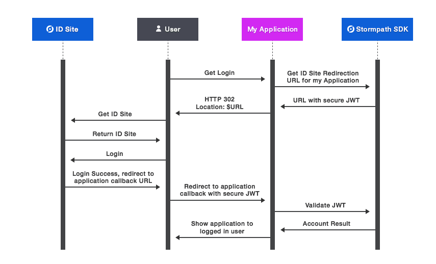

.. _idsite:

****************
8. Using ID Site
****************

a. What is an ID Site?
======================

Stormpath ID Site is a set of hosted and pre-built user interface screens that take care of common identity functions for your applications — log in, registration, and password reset. ID Site can be accessed via your own custom domain like ``id.mydomain.com`` and shared across multiple applications to create centralized authentication.

The screens and functionality of ID Site are completely customizable. You have full access to the source code of the ID Site screens so you can make simple changes like adding your own logo and changing CSS or more complex changes like adding fields, JavaScript code, screens, removing screens, and even changing how the screens behave.

Why should I use Stormpath ID Site?
-----------------------------------

Building, securing, and maintaining identity screens for your users is time consuming, full of security concerns, and often more complex than many developers estimate. Stormpath ID Site gives you and your development team peace of mind that you will have best in class user security quickly and easily, with very little code — minimizing risk to your project timeline.

Stormpath ID Site fully decouples your identity screens from your applications, making it incredibly easy to provide the same login / registration pages for multiple applications — achieving centralized user management and authentication with a clean and easy user experience.

b. How does ID Site Work?
=========================

To demonstrate how the SDK works, we'll use an example. Imagine you are building an application for managing Stormtrooper equipment — like awesome helmets and blasters. The application is "Imperial Exchange", available at http://imperialxchange.com/, and it uses Stormpath ID Site for login and registration.

Once ImperialXchange.com is rendered by the browser, login and registration buttons are available for the unauthenticated user. Clicking on these buttons will call your server-side application at specific endpoints. For illustration, the login button will invoke ``/login`` and registration will invoke ``/register``. Your application using the Stormpath SDK will securely redirect the user to the ID Site along with a cryptographically signed JSON Web Token (JWT) that includes information like the Callback URI, the path to a specific ID Site page, and any State you think is important for your application.

On the ID Site, the user will enter their data and complete the appropriate action, like login. ID Site will automatically detect any Workflow or Social Login configurations set in Stormpath and show the appropriate buttons, messaging, and behavior.

After the user has logged-in successfully, they will be redirected back to your application’s Callback URI. For illustration purposes, this could be ``https://imperialxchange.com/idSiteResult``. When the ID Site redirects back to your application, it will pass a secure JWT that represents the account in Stormpath. Using the Stormpath SDK, your application will handle the request to ``/idSiteResult``, validate that the JWT is correct, and return an ``ID Site Account Result``. The ``ID Site Account Result`` will include the Stormpath Account object and additional information, such as any state that was passed by your application or whether or not the Account returned is newly created.

    *The ID Site Flow* 

.. _idsite-set-up:

c. ID Site Set Up
=================

Setting Up Your ID Site
-----------------------

Your ID Site uses a default configuration for testing purposes, but can be fully configured to host customized code or to use your own custom domain.

To set up your ID Site, log into the `Administrator Console <https://api.stormpath.com/login>`_ and:

1. Click on the "ID Site" Tab.
2. Add your application URLs that will be allowed to process the callbacks from the ID Site to the "Authorized Redirect URIs" property. These URLs will be hosted by your application and will use the Stormpath SDK to process the security assertions about the user that ID Site sends back.
3. Click the "Update" button at the bottom of the page.
   
Once you configure your ID site, a default subdomain will be created on ``stormpath.io``. The default ID Site URL follows the format of ``tenant-name.id.stormpath.io`` where ``tenant-name`` is the name of your Stormpath Tenant.

.. note::

	Your ID Site URL can only be accessed via a redirect from a Stormpath-enabled application because ID Site expects a cryptographically signed token with specific data in it. Simply visiting your ID Site URL in a browser will give you an error.

For more advanced configurations, there are additional properties in the ID Site configuration that can help:

- Set a Logo to appear at the top of the default ID Site
- Set a custom domain name (like id.mydomain.com) and SSL certificate to host your ID Site from your domain, securely
- Set a custom GitHub repo to host your ID Site (to host custom code)

.. _idsite-custom-domain-ssl:

Setting Your Own Custom Domain Name and SSL Certificate
^^^^^^^^^^^^^^^^^^^^^^^^^^^^^^^^^^^^^^^^^^^^^^^^^^^^^^^

By default, the address of your ID Site is ``tenant-name.id.stormpath.io``. However, you can change the address to a subdomain of your own website, such as ``id.mysite.com``. The Stormtrooper equipment application’s main website is ``imperialxchange.com``, so the initial address of the ID Site might be something like ``happy-rebel.id.stormpath.io``. You can change the ID Site’s address to a subdomain of your company website, like ``id.trooperxchange.com``. In our example, ImperialXchange.com is actually part of a family of sites owned by the parent company Galactic Gear. Galactic Gear wants single-sign-on across its family of websites, so the ID Site is actually found at ``id.galacticgear.co``.

The workflow for changing the address consists of the following steps:

1. Get a domain name and a subdomain (if you have not already)
2. Configure the subdomain as an alias of your ID Site 
3. Enable the custom domain in Stormpath’s ID Site configuration
4. Input SSL information for Stormpath to host

For more information on each of these steps, read on.

1. Get a Domain Name and a Subdomain
""""""""""""""""""""""""""""""""""""

Purchase and register a domain name with a domain registrar. You can purchase and register a domain name from any domain registrar, including GoDaddy, Yahoo! Domains, 1&1, Netregistry, or Register.com. For instructions, see the Help on the registrar’s website.

Create a subdomain for your domain for your ID Site. See the Help on the registrar’s website for instructions on adding a subdomain. You can call the subdomain “id”, “login” or something similar. Example: "id.galacticgear.com".

2. Make the Subdomain an Alias of your ID Site on Stormpath
"""""""""""""""""""""""""""""""""""""""""""""""""""""""""""

The next step is to make your subdomain an alias of your ID Site on Stormpath. An alias is simply an alternate address for a website. For example, you can make the addresses “id.galacticgear.com” and “happy-rebel.id.stormpath.io” interchangeable as far as web browsers are concerned.

To make your subdomain an alias of your ID Site website on Stormpath, you must use your domain registrar’s tools and UI. These steps will generally require you to:

- Log in to your domain registrar’s control panel.
- Look for the option to change DNS records.
- Locate or create the CNAME records for your domain.
- Point the CNAME record from your subdomain (ex. “id” or “login”) to your ID Site subdomain (ex. happy-rebel.id.stormpath.io)

.. note::

	It takes time for changes to the DNS system to be implemented. Typically, it can take anywhere from a few hours to a day, depending on your Time To Live (TTL) settings in the registrar’s control panel.

3. Enable the Custom Domain in Stormpath's ID Site Configuration
""""""""""""""""""""""""""""""""""""""""""""""""""""""""""""""""

After making your subdomain an alias of your ID Site on Stormpath, you must enable a custom domain in the Stormpath Admin Console. If you omit this step, your subdomain will point to a error page rather than your ID Site.

To set up a custom domain on ID Site, log into the Administrator Console and:

- Click on the "ID Site" Tab
- Click the "Custom" option under "Domain Name".
- Type in the subdomain for your ID Site (ex: id.galacticgear.com)
- Click the "Update" button at the bottom of the page

4. Set up SSL on your ID Site
"""""""""""""""""""""""""""""

Since Stormpath is hosting the ID Site under your custom subdomain, to secure it using SSL you must provide the SSL certificate information to Stormpath. Creating SSL certificates is an involved task which requires working with a certificate authority such as Verisign and includes:

- Generating a certificate request (CSR) with a Distinguished Name (DN) that matches your subdomain (ex. id.galacticgear.com)
- Provide the CSR file to a certificate authority such as Verisign. The certificate authority generates a SSL certificate and gives it to you so that it can be installed on Stormpath’s servers.

Once the SSL certificate is retrieved from the certificate authority, you can log-in to the Administrator Console and configure SSL:

- Click on the ID Site Tab
- Open the zip to retrieve your .pem file if needed.
- Copy the text for the SSL certificate and Private Key to the appropriate text boxes on the ID Site Tab
- Click the Update button at the bottom of the page
- When the ID Site is updated, the SSL information is uploaded to Stormpath and will update your ID Site automatically.

.. _idsite-app-set-up:

Setting up your Application to use ID Site
------------------------------------------

In order to set up your application to use ID Site, you will need to install the Stormpath SDK and register the application in Stormpath. The Stormpath SDK and hosted ID Site will do most of the work for your application, including signing and unpacking secure communication between themselves. For more information, please see the `relevant Stormpath SDK documentation <https://docs.stormpath.com/home/>`__.

d. Using ID Site Via REST API
=============================

The Stormpath SDKs help developers quickly integrate communication from Stormpath's ID Site to their application. However, it is possible to use ID Site without an Stormpath SDK using the REST API. To use ID Site with the REST API, it is required to understand how to generate and sign JSON Web Tokens (JWT).

Below are language specific JWT libraries that Stormpath has sanity tested with ID Site.

- .NET JWT - https://github.com/jwt-dotnet/jwt
- Ruby JWT - https://github.com/jwt/ruby-jwt
- Go JWT - https://github.com/dgrijalva/jwt-go
- PHP JWT - https://github.com/firebase/php-jwt
- Python JWT - https://github.com/jpadilla/pyjwt
- Java JWT - https://github.com/jwtk/jjwt
- Node JWT - https://github.com/jwtk/njwt

To use ID Site without an Stormpath SDK there are two flows that need to be implemented:

1. Getting a user to ID Site
2. Handling the Callback to your Application from ID Site

So, let's show you how to do exactly that!

.. _idsite-direct-user:

1. Getting a User to ID Site
----------------------------

When a user wants to log into, or register for, your application, you will need to redirect them to your ID Site.

A typical set of steps in your application are as follows:

#. You render your application with a login button
#. The user clicks the login button which will send a request to your server
#. Your server will generate a JWT and include the valid information
#. Your server responds with an HTTP 302 which redirects the user to the ID Site SSO endpoint
#. Stormpath will redirect the user to your ID Site

The JWT must meet these specifications

- Signed using your Stormpath API Key Secret
- Signed using the HS256 algorithm

The `claims <https://tools.ietf.org/html/rfc7519#section-4.1>`_ for the JWT are as follows:

.. list-table::
	:widths: 15 10 60
	:header-rows: 1

	* - Claim Name 
	  - Required?
	  - Valid Value(s)

	* - ``iat``
	  - Yes
	  - The "Issued At Time", which is the time the token was issued, expressed in Unix time.

	* - ``iss``
	  - Yes
	  - The issuer of the token. You should put your Stormpath API Key ID here.

	* - ``sub``
	  - Yes
	  - The subject of the token. You should put your Stormpath Application resource's href here.

	* - ``cb_uri``
	  - Yes
	  - The callback URI to use once the user takes an action on the ID Site. This must match a "Authorized Redirect URI" in the Stormpath ID Site configuration.

	* - ``jti``
	  - Yes
	  - A universally unique identifier for the token. This can be generated using a GUID or UUID function of your choice.

	* - ``path``
	  - No
	  - The path on the ID Site that you want the user to land on. Use ``/`` for login page, ``/#/register`` for the sign up page, ``/#/forgot`` for the forgot password page, ``/#/reset`` for the password reset page.

	* - ``state``
	  - No
	  - The state of the application that you need to pass through the ID Site back to your application through the callback. It is up to the developer to serialize/deserialize this value

	* - ``organizationNameKey``
	  - No
	  - The string representing the ``nameKey`` for an Organization that is an Account Store for your application. This is used for multitenant applications that use ID Site.

	* - ``showOrganizationField``
	  - No 
	  - A boolean representing if the "Organization" field should show on the forms that ID Site renders.

Once the JWT is generated by your server, you must respond with or send the browser to::

	HTTP/1.1 302 Found
	Location: https://api.stormpath.com/sso?jwtRequest=%GENERATED_JWT%

The Stormpath ``/sso`` endpoint will validate the JWT, and redirect the user to your ID Site.

2. Handling the Callback to your Application from ID Site
---------------------------------------------------------

Once the user signs up or logs in to your application, they will be redirected back to your application using the ``cb_uri`` callback property that was set in the JWT. In addition to the callback URI, ID Site will include a ``jwtResponse`` parameter in the query. For example, if the specified ``cb_uri`` is ``https://yourapp.com/dashboard`` then the user will be redirected to::

	https://yourapp.com/dashboard?jwtResponse={GENERATED_ID_SITE_ASSERTION_JWT}

The ``jwtResponse`` represents a JWT that provides a signed security assertion about who the user is and what they did on ID Site.

Before you trust any of the information in the JWT, you MUST:

- Validate the signature with your API Key Secret from Stormpath. This will prove that the information stored in the JWT has not been tampered with during transit.
- Validate that the JWT has not expired

.. note::

	If you are using a library to generate a JWT, these usually have methods to help you validate the JWT. Some libraries will only validate the signature, but not the expiration time. Please review your JWT library to verify its capabilities.

Once the JWT is validated, you can read information about the user from the JWT. The JWT contains the following information:

.. _idsite-jwt-claims:

.. list-table::
	:widths: 15 60
	:header-rows: 1

	* - Claim Name 
	  - Description
	
	* - ``iss`` 
	  - The issuer of the JWT. This will match your ID Site domain and can be used for additional validation of the JWT.

	* - ``sub`` 
	  - The subject of the JWT. This will be an ``href`` for the Stormpath Account that signed up or logged into the ID Site. This ``href`` can be queried by using the REST API to get more information about the Account.

	* - ``aud`` 
	  - The audience of the JWT. This will match your API Key ID from Stormpath.

	* - ``exp`` 
	  - The expiration time for the JWT in Unix time.

	* - ``iat`` 
	  - The time at which the JWT was created, in Unix time.

	* - ``jti`` 
	  - A one-time-use-token for the JWT. If you require additional security around the validation of the token, you can store the ``jti`` in your application to validate that a particular JWT has only been used once.

	* - ``state`` 
	  - The state of your application, if you have chosen to have this passed back.

	* - ``status`` 
	  - The status of the request from ID Site. Valid values are ``AUTHENTICATED``, ``LOGOUT``, or ``REGISTERED``.

In some cases you may wish to exchange this JWT for a Stormpath OAuth 2.0 token.

.. _idsite-jwt-to-oauth:

Exchanging the ID Site JWT for an OAuth Token
^^^^^^^^^^^^^^^^^^^^^^^^^^^^^^^^^^^^^^^^^^^^^

For background information, please see :ref:`token-authn`. In this situation, after the user has been authenticated via ID Site, a developer may want to control their authorization with an OAuth 2.0 Token. This is done by passing the JWT similar to the way we passed the user's credentials as described in :ref:`generate-oauth-token`. The difference is that instead of using the ``password`` grant type and passing credentials, we will use the ``id_site_token`` type and pass the JWT we got from the ID Site.

.. code-block:: http 

  POST /v1/applications/$YOUR_APPLICATION_ID/oauth/token HTTP/1.1
  Host: api.stormpath.com
  Content-Type: application/x-www-form-urlencoded

  grant_type=id_site_token&token={$JWT_FROM_ID_SITE}

Stormpath will validate the JWT (i.e. ensure that it has not been tampered with, is not expired, and the Account that its associated with is still valid) and then return an OAuth 2.0 Access Token:

.. code-block:: http

  HTTP/1.1 200 OK
  Content-Type: application/json;charset=UTF-8

  {
    "access_token": "eyJraWQiOiIyWkZNV...TvUt2WBOl3k",
    "refresh_token": "eyJraWQiOiIyWkZNV...8TvvrB7cBEmNF_g",
    "token_type": "Bearer",
    "expires_in": 1800,
    "stormpath_access_token_href": "https://api.stormpath.com/v1/accessTokens/1vHI0jBXDrmmvPqEXaMPle"
  }

For more information about Stormpath's OAuth 2.0 tokens, please see :ref:`generate-oauth-token`. 

Logging Out of ID Site with REST 
--------------------------------

ID Site will keep a configurable session for authenticated users. When a user is sent from your application to ID Site, it will confirm that the session is still valid for the user. If it is, they will be automatically redirected to the ``cb_uri``. This ``cb_uri`` can be the originating application or any application supported by a Stormpath SDK.

To log the user out and remove the session that ID Site creates, you must create a JWT similar to the one that got the user to ID Site, but instead of redirecting to the ``/sso`` endpoint, you redirect the user to ``/sso/logout``.

So, once the JWT is generated by your server, you must respond with or send the browser to::

	HTTP/1.1 302 Found
	Location: https://api.stormpath.com/sso/logout?jwtRequest=%GENERATED_JWT%

Once the user is logged out of ID Site, they are automatically redirected to the ``cb_uri`` which was specified in the JWT. Your application will know that the user logged out because the ``jwtResponse`` will contain a status claim of ``LOGOUT``.

.. _idsite-password-reset:

Resetting Your Password with ID Site 
------------------------------------

The Account Management chapter has an overview of :ref:`password-reset-flow` in Stormpath. In that flow, a user chooses to reset their password, then receives an email with a link to a page on your application that allows them to set a new password. If you are using ID Site for login, then it stands to reason that you would want them to land on your ID Site for password reset as well. The issue here, however, is bridging the Password Reset Flow and the ID Site flow. 

Using a JWT library, you have to generate a new JWT, with all of :ref:`the usual required claims <idsite-jwt-claims>`. The ``path`` claim should be set to ``/#/reset`` and you will also have to include an additional claim: ``sp_token``. This is the ``sp_token`` value that you will have received from the link that the user clicked in their password reset email. This JWT is then passed to the ``/sso`` endpoint (as described in Step 1 above), and the user is taken to the Password Reset page on your ID Site.  
