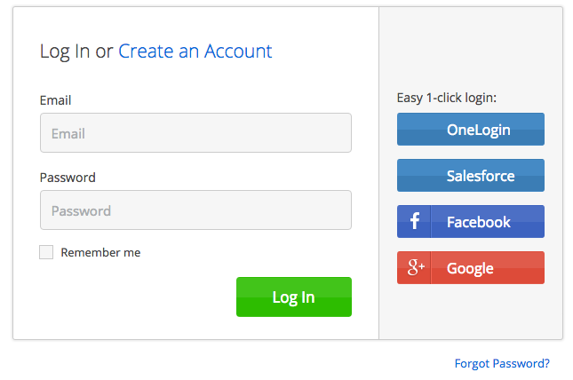

.. _idsite:

****************
7. Using ID Site
****************

7.1. What is an ID Site?
========================

Stormpath ID Site is a set of hosted and pre-built user interface screens that take care of common identity functions for your applications — log in, registration, and password reset. ID Site can be accessed via your own custom domain like ``id.mydomain.com`` and shared across multiple applications to create centralized authentication. It supports regular login to your Stormpath Directories, as well as Social and SAML login.

    *An example ID Site*

The screens and functionality of ID Site are completely customizable. You have full access to the source code of the ID Site screens so you can make simple changes like adding your own logo and changing CSS or more complex changes like adding fields, JavaScript code, screens, removing screens, and even changing how the screens behave.

Why should I use Stormpath ID Site?
-----------------------------------

Building, securing, and maintaining identity screens for your users is time consuming, full of security concerns, and often more complex than many developers estimate. Stormpath ID Site gives you and your development team peace of mind that you will have best in class user security quickly and easily, with very little code — minimizing risk to your project timeline.

Stormpath ID Site fully decouples your identity screens from your applications, making it incredibly easy to provide the same login / registration pages for multiple applications — achieving centralized user management and authentication with a clean and easy user experience.

Browser Support
---------------

ID Site will work in the following web browser environments:

- Chrome (all versions)
- Internet Explorer 10+
- Firefox 23+
- Safari 8+
- Android Browser, if Android version is 4.1 (Jellybean) or greater

7.2. How does ID Site Work?
===========================

To demonstrate how ID Site works, we'll use an example. Imagine you are building an application for managing Stormtrooper equipment — like awesome helmets and blasters. The application is "Imperial Exchange", available at ``https://imperialxchange.com/``, and it uses Stormpath ID Site for login and registration.

Once ImperialXchange.com is rendered by the browser, "Log In" and "Sign Up" links are available for the unauthenticated user. Clicking on these will call your server-side application at specific endpoints. For illustration, the "Log In" link will invoke ``/login`` and "Sign Up" will invoke ``/register``. Your application will securely redirect the user to the ID Site along with a cryptographically signed JSON Web Token (JWT) that includes information like the Callback URI, the path to a specific ID Site page, and any State you think is important for your application.

On the ID Site, the user will enter their data and complete the appropriate action, like login. ID Site will automatically detect any Workflow or Social Login configurations set in Stormpath and show the appropriate buttons, messaging, and behavior.

After the user has logged-in successfully, they will be redirected back to your application’s Callback URI. For illustration purposes, this could be ``https://imperialxchange.com/idSiteResult``. When the ID Site redirects back to your application, it will pass a secure JWT that represents the account in Stormpath. Using the Stormpath SDK, your application will handle the request to ``/idSiteResult``, validate that the JWT is correct, and return an ``ID Site Account Result``. The ``ID Site Account Result`` will include the Stormpath Account object and additional information, such as any state that was passed by your application or whether or not the Account returned is newly created.

.. figure:: images/idsite/id_site_flow.png
    :align: center
    :scale: 100%
    :alt: ID Site Flow

    *The ID Site Flow*

.. _idsite-set-up:

7.3. ID Site Set Up
===================

7.3.1. Setting Up Your ID Site
------------------------------

Your ID Site uses a default configuration for testing purposes, but can be fully configured to host customized code or to use your own custom domain.

To set up your ID Site, log into the `Administrator Console <https://api.stormpath.com/login>`_ and:

1. Click on the "ID Site" Tab.
2. Add your application URLs that will be allowed to process the callbacks from the ID Site to the "Authorized Redirect URIs" property. These URLs will be hosted by your application and will use the Stormpath SDK to process the security assertions about the user that ID Site sends back.
3. Click the "Update" button at the bottom of the page.

Once you configure your ID site, a default subdomain will be created on ``stormpath.io``. The default ID Site URL follows the format of ``tenant-name.id.stormpath.io`` where ``tenant-name`` is the name of your Stormpath Tenant.

.. note::

	Your ID Site URL can only be accessed via a redirect from a Stormpath-enabled application because ID Site expects a cryptographically signed token with specific data in it. Simply visiting your ID Site URL in a browser will give you an error.

For more advanced configurations, there are additional properties in the ID Site configuration that can help:

- Set a Logo to appear at the top of the default ID Site
- Set a custom domain name (like id.mydomain.com) and SSL certificate to host your ID Site from your domain, securely
- Set a custom GitHub repo to host your ID Site (to host custom code)

.. _idsite-custom-domain-ssl:

Setting Your Own Custom Domain Name and SSL Certificate
^^^^^^^^^^^^^^^^^^^^^^^^^^^^^^^^^^^^^^^^^^^^^^^^^^^^^^^

By default, the address of your ID Site is ``tenant-name.id.stormpath.io``. However, you can change the address to a subdomain of your own website, such as ``id.mysite.com``. The Stormtrooper equipment application’s main website is ``imperialxchange.com``, so the initial address of the ID Site might be something like ``happy-rebel.id.stormpath.io``. You can change the ID Site’s address to a subdomain of your company website, like ``id.trooperxchange.com``. In our example, ImperialXchange.com is actually part of a family of sites owned by the parent company Galactic Gear. Galactic Gear wants single sign-on across its family of websites, so the ID Site is actually found at ``id.galacticgear.co``.

The workflow for changing the address consists of the following steps:

1. Get a domain name and a subdomain (if you have not already)
2. Configure the subdomain as an alias of your ID Site
3. Enable the custom domain in Stormpath’s ID Site configuration
4. Input SSL information for Stormpath to host

For more information on each of these steps, read on.

1. Get a Domain Name and a Subdomain
""""""""""""""""""""""""""""""""""""

Purchase and register a domain name with a domain registrar. You can purchase and register a domain name from any domain registrar, including GoDaddy, Yahoo! Domains, 1&1, Netregistry, or Register.com. For instructions, see the Help on the registrar’s website.

Create a subdomain for your domain for your ID Site. See the Help on the registrar’s website for instructions on adding a subdomain. You can call the subdomain “id”, “login” or something similar. Example: "id.galacticgear.com".

2. Make the Subdomain an Alias of your ID Site on Stormpath
"""""""""""""""""""""""""""""""""""""""""""""""""""""""""""

The next step is to make your subdomain an alias of your ID Site on Stormpath. An alias is simply an alternate address for a website. For example, you can make the addresses “id.galacticgear.com” and “happy-rebel.id.stormpath.io” interchangeable as far as web browsers are concerned.

To make your subdomain an alias of your ID Site website on Stormpath, you must use your domain registrar’s tools and UI. These steps will generally require you to:

- Log in to your domain registrar’s control panel.
- Look for the option to change DNS records.
- Locate or create the CNAME records for your domain.
- Point the CNAME record from your subdomain (ex. “id” or “login”) to your ID Site subdomain (ex. happy-rebel.id.stormpath.io)

.. note::

	It takes time for changes to the DNS system to be implemented. Typically, it can take anywhere from a few hours to a day, depending on your Time To Live (TTL) settings in the registrar’s control panel.

3. Enable the Custom Domain in Stormpath's ID Site Configuration
""""""""""""""""""""""""""""""""""""""""""""""""""""""""""""""""

After making your subdomain an alias of your ID Site on Stormpath, you must enable a custom domain in the Stormpath Admin Console. If you omit this step, your subdomain will point to a error page rather than your ID Site.

To set up a custom domain on ID Site, log into the Administrator Console and:

- Click on the "ID Site" Tab
- Click the "Custom" option under "Domain Name".
- Type in the subdomain for your ID Site (ex: id.galacticgear.com)
- Click the "Update" button at the bottom of the page

4. Set up SSL on your ID Site
"""""""""""""""""""""""""""""

Since Stormpath is hosting the ID Site under your custom subdomain, to secure it using SSL you must provide the SSL certificate information to Stormpath. Creating SSL certificates is an involved task which requires working with a certificate authority such as Verisign and includes:

- Generating a certificate request (CSR) with a Distinguished Name (DN) that matches your subdomain (ex. id.galacticgear.com)
- Provide the CSR file to a certificate authority such as Verisign. The certificate authority generates a SSL certificate and gives it to you so that it can be installed on Stormpath’s servers.

Once the SSL certificate is retrieved from the certificate authority, you can log-in to the Administrator Console and configure SSL:

- Click on the ID Site Tab
- Open the zip to retrieve your .pem file if needed.
- Copy the text for the SSL certificate and Private Key to the appropriate text boxes on the ID Site Tab
- Click the Update button at the bottom of the page
- When the ID Site is updated, the SSL information is uploaded to Stormpath and will update your ID Site automatically.

.. _idsite-app-set-up:

Setting up your Application to use ID Site
------------------------------------------

In order to set up your application to use ID Site, you will need to install the Stormpath SDK and register the application in Stormpath. The Stormpath SDK and hosted ID Site will do most of the work for your application, including signing and unpacking secure communication between themselves. For more information, please see the `relevant Stormpath SDK documentation <https://docs.stormpath.com/home/>`__.

.. _idsite-with-rest:

7.4. Using ID Site Via |language|
=================================

The Stormpath SDKs help developers quickly integrate communication from Stormpath's ID Site to their application.

.. only:: rest

  However, it is possible to use ID Site without a Stormpath SDK using the REST API.

To use ID Site there are two flows that need to be implemented:

1. Getting a user to ID Site
2. Handling the Callback to your Application from ID Site

So, let's show you how to do exactly that!

.. _idsite-direct-user:

Step 1: Getting a User to ID Site
---------------------------------

When a user wants to log into, or register for, your application, you will need to redirect them to your ID Site.

A typical set of steps in your application are as follows:

#. You render your application with a login button
#. The user clicks the login button which will send a request to your server
#. Your server will generate a JWT and include the valid information
#. Your server responds with an HTTP 302 which redirects the user to the ID Site SSO endpoint
#. Stormpath will redirect the user to your ID Site

.. only:: rest

  .. _idsite-auth-jwt:

  ID Site Authentication JWT
  ^^^^^^^^^^^^^^^^^^^^^^^^^^

  First you will have to generate a JWT. Below are language specific JWT libraries that Stormpath has sanity tested with ID Site.

  - .NET JWT - https://github.com/jwt-dotnet/jwt
  - Ruby JWT - https://github.com/jwt/ruby-jwt
  - Go JWT - https://github.com/dgrijalva/jwt-go
  - PHP JWT - https://github.com/firebase/php-jwt
  - Python JWT - https://github.com/jpadilla/pyjwt
  - Java JWT - https://github.com/jwtk/jjwt
  - Node JWT - https://github.com/jwtk/njwt

  .. note::

    This key must be signed with your API Key Secret.

  The token itself will contain two parts, a Header and a Body that itself contains claims. You will have to add all of these into the JWT that you generate:

  **Header**

  .. list-table::
    :widths: 15 10 60
    :header-rows: 1

    * - Header Name
      - Required?
      - Valid Value(s)

    * - ``kid``
      - Yes
      - The ID of the Stormpath API Key that signed this JWT.

    * - ``alg``
      - Yes
      - The algorithm that was used to sign this key. The only valid value is ``HS256``.

  **Body**

  The `claims <https://tools.ietf.org/html/rfc7519#section-4.1>`_ for the JWT body are as follows:

  .. list-table::
    :widths: 15 10 60
    :header-rows: 1

    * - Claim Name
      - Required?
      - Valid Value(s)

    * - ``iat``
      - Yes
      - The "Issued At Time", which is the time the token was issued, expressed in Unix time.

    * - ``iss``
      - Yes
      - The issuer of the token. You should put your Stormpath API Key ID here.

    * - ``sub``
      - Yes
      - The subject of the token. You should put your Stormpath Application resource's href here.

    * - ``cb_uri``
      - Yes
      - The callback URI to use once the user takes an action on the ID Site. This must match a Authorized Callback URI on Application resource.

    * - ``jti``
      - Yes
      - A universally unique identifier for the token. This can be generated using a GUID or UUID function of your choice.

    * - ``path``
      - No
      - The path on the ID Site that you want the user to land on. Use ``/`` for login page, ``/#/register`` for the sign up page, ``/#/forgot`` for the forgot password page, ``/#/reset`` for the password reset page.

    * - ``state``
      - No
      - The state of the application that you need to pass through ID Site back to your application through the callback. It is up to the developer to serialize/deserialize this value

    * - ``onk``
      - No
      - The string representing the ``nameKey`` for an Organization that is an Account Store for your application. This is used for multitenant applications that use ID Site.

    * - ``sof``
      - No
      - A boolean representing if the "Organization" field should show on the forms that ID Site renders.

    * - ``usd``
      - No
      - A boolean indicating whether the ID Site should be redirected to a subdomain based on an Organization nameKey.

  Once the JWT is generated by your server, you must respond with or send the browser to::

  	HTTP/1.1 302 Found
  	Location: https://api.stormpath.com/sso?jwtRequest=$GENERATED_JWT

  The Stormpath ``/sso`` endpoint will validate the JWT, and redirect the user to your ID Site.

.. only:: csharp or vbnet

  This is typically done by creating a controller or action that the login button redirects to. Inside this controller, the ID Site request can be created using the SDK:

  .. only:: csharp

    .. literalinclude:: code/csharp/idsite/build_idsite_url.cs
      :language: csharp

  .. only:: vbnet

    .. literalinclude:: code/vbnet/idsite/build_idsite_url.vb
      :language: vbnet

  The ``SetCallbackUri`` method sets the location in your application the user will be returned to when they complete the ID Site flow.

  .. note::

    To view all of the options available for building ID Site URLs, see the `IIdSiteBuilder API documentation <https://docs.stormpath.com/dotnet/api/html/T_Stormpath_SDK_IdSite_IIdSiteUrlBuilder.htm>`_.

  Once the URL is built, redirect the user in order to send them to ID Site.

.. only:: java

    This is typically done by creating a controller or action that the login button redirects to. Inside this controller, the ID Site request can be created using the SDK:

    .. literalinclude:: code/java/idsite/build_idsite_url.java
      :language: java

    The ``setCallbackUri`` method sets the location in your application the user will be returned to when they complete the ID Site flow.

    .. note::

      To view all of the options available for building ID Site URLs, see the `IdSiteUrlBuilder API documentation <https://docs.stormpath.com/java/apidocs/com/stormpath/sdk/idsite/IdSiteUrlBuilder.html>`_.

    Once the URL is built, redirect the user in order to send them to ID Site.

.. only:: nodejs

  This is typically done by creating a controller or action that the login button redirects to. Inside this controller, the ID Site request can be created using the SDK:

  .. literalinclude:: code/nodejs/idsite/build_idsite_url.js
    :language: javascript

  The ``callbackUri`` option to the `createIdSiteUrl()` method sets the location in your application the user will be returned to when they complete the ID Site flow.

  Once the URL is built, redirect the user in order to send them to ID Site.

.. only:: php

  The PHP SDK has built-in functionality to generate a URL to redirect your users to for login.

  To generate this URL, you need to first get access to your ``Application`` resource object:

  .. code-block:: php

    $application = $client
                    ->dataStore
                    ->getResource(
                        'https://api.stormpath.com/v1/applications/16k5PC57Imx4nWXQXi74HO',
                        \Stormpath\Resource\Application::class
                    );

  Once you have your Account, you get access to a ``createIdSiteUrl()`` method.  This method is the core of the ID Site usage in the PHP SDK. It accepts one parameter, an options array.

  .. list-table::
    :widths: 15 10 60
    :header-rows: 1

    * - Key
      - Required?
      - Description

    * - ``callbackUri``
      - Yes
      - The callback URI to use once the user takes an action on the ID Site. This must match a Authorized Callback URI on Application resource.

    * - ``path``
      - No
      - The path on the ID Site that you want the user to land on. Use ``/`` for login page, ``/#/register`` for the sign up page, ``/#/forgot`` for the forgot password page, ``/#/reset`` for the password reset page.

    * - ``state``
      - No
      - The state of the application that you need to pass through ID Site back to your application through the callback. It is up to the developer to serialize/deserialize this value

    * - ``organizationNameKey``
      - No
      - The string representing the ``nameKey`` for an Organization that is an Account Store for your application. This is used for multi-tenant applications that use ID Site.

    * - ``showOrganizationField``
      - No
      - A boolean representing if the "Organization" field should show on the forms that ID Site renders.

    * - ``useSubDomain``
      - No
      - A boolean indicating whether the ID Site should be redirected to a subdomain based on an Organization nameKey.

  To use the ``createIdSiteUrl()`` method for login, you would need to first add the callback URI for your application. This callback URI is where ID Site is allowed to send the request back to and where you would handle the response. This will be explained in the next section.

  .. code-block:: php

    $loginLink = $application->createIdSiteUrl([
        'callbackUri' => 'https://mysite.com/handleIdSiteCallback.php'
    ]);

    header('Location: ' . $loginLink); // Or another form of redirect to generated URL

  .. note::

    The code above should be the only code for the login.  The ``createIdSiteUrl()`` method will set the issued at time.  These tokens do expire and will display errors if it is generated before the user clicks to login.

.. only:: python

  This is typically done by calling the ``build_id_site_redirect_url`` method on your Application object to generate a URL that you will then redirect your user to:

  .. literalinclude:: code/python/idsite/build_idsite_url.py
    :language: python

  The ``callback_uri`` option to the ``build_id_site_redirect_url()`` method sets the location in your application the user will be returned to when they complete the ID Site flow.

  Once the URL is built, redirect the user in order to send them to ID Site.

.. only:: ruby

  This is typically done by calling the ``create_id_site_url`` method on your ``Application`` object to generate a URL that you will then redirect your user to:

  .. literalinclude:: code/ruby/idsite/build_idsite_url.rb
    :language: ruby

  The ``callback_uri`` option to the ``create_id_site_url`` method sets the location in your application the user will be returned to when they complete the ID Site flow.

  Once the URL is built, redirect the user in order to send them to ID Site.

Step 2: Handling the Callback to your Application from ID Site
--------------------------------------------------------------

Once the user signs up or logs in to your application, they will be redirected back to your application's configured Callback URI that was set in the JWT. In addition to the Callback URI, ID Site will include a ``jwtResponse`` parameter in the query. For example, if the specified Callback URI is ``https://yourapp.com/dashboard`` then the user will be redirected to::

  https://yourapp.com/dashboard?jwtResponse={GENERATED_ID_SITE_ASSERTION_JWT}

The ``jwtResponse`` represents a JWT that provides a signed security assertion about who the user is and what they did on ID Site.

.. only:: rest

  .. _idsite-response-jwt:

  ID Site Assertion JWT
  ^^^^^^^^^^^^^^^^^^^^^

  Before you trust any of the information in the JWT, you must:

  - Validate the signature with your API Key Secret from Stormpath. This will prove that the information stored in the JWT has not been tampered with during transit.
  - Validate that the JWT has not expired

  .. note::

  	If you are using a library to generate a JWT, these usually have methods to help you validate the JWT. Some libraries will only validate the signature, but not the expiration time. Please review your JWT library to verify its capabilities.

  The Header and Body claims found in this JWT are as follows:

  **Header**

  .. list-table::
    :widths: 15 10 60
    :header-rows: 1

    * - Claim Name
      - Required?
      - Valid Value(s)

    * - ``typ``
      - Yes
      - The type of token, which will be ``JWT``

    * - ``alg``
      - Yes
      - The algorithm that was used to sign this key. The only possible value is ``HS256``.

    * - ``kid``
      - Yes
      - The ID of the Stormpath API Key that signed this JWT.

  **Body**

  Once the user has been authenticated by ID Site or the SAML IdP, you will receive back a JWT response. The JWT contains the following information:

  .. list-table::
    :widths: 15 60
    :header-rows: 1

    * - Claim Name
      - Description

    * - ``iss``
      - This will match your ID Site domain and can be used for additional validation of the JWT.

    * - ``sub``
      - The subject of the JWT. This will be an ``href`` for the Stormpath Account that signed up or logged into the ID Site / SAML IdP. This ``href`` can be queried by using the REST API to get more information about the Account.

    * - ``aud``
      - The audience of the JWT. This will match your API Key ID from Stormpath.

    * - ``exp``
      - The expiration time for the JWT in Unix time.

    * - ``iat``
      - The time at which the JWT was created, in Unix time.

    * - ``jti``
      - A one-time-use-token for the JWT. If you require additional security around the validation of the token, you can store the ``jti`` in your application to validate that a particular JWT has only been used once.

    * - ``irt``
      - The ``jti`` of the :ref:`ID Site Authentication JWT <idsite-auth-jwt>` that was sent to generate this Assertion JWT.

    * - ``state``
      - The state of your application, if you have chosen to have this passed back.

    * - ``isNewSub``
      - A boolean value indicating whether this is a new Account in Stormpath.

    * - ``status``
      - The status of the request. Valid values for ID Site are ``AUTHENTICATED``, ``LOGOUT``, or ``REGISTERED``.

    * - ``cb_uri``
      - The callback URI for this JWT.

.. only:: csharp or vbnet

  You'll need to create a controller or action that handles the Callback URI. Then, you can use the SDK to consume this assertion:

  .. only:: csharp

    .. literalinclude:: code/csharp/idsite/consume_assertion.cs
      :language: csharp

  .. only:: vbnet

    .. literalinclude:: code/vbnet/idsite/consume_assertion.vb
      :language: vbnet

  The SDK will throw an error if the ID Site assertion is expired or invalid. If the assertion is valid, you'll get an ``IAccountResult`` instance with the following properties:

  * ``State`` - An arbitrary string set by the ``SetState()`` method, if any.
  * ``IsNewAccount`` - ``true`` if the account was newly registered on ID Site, ``false`` if an existing account signed in.
  * ``Status`` - One of ``IdSiteResultStatus.Registered``, ``IdSiteResultStatus.Authenticated``, ``IdSiteResultStatus.Logout``.

  You can call the ``GetAccountAsync`` method to obtain the Stormpath Account itself.

.. only:: java

  You'll need to create a controller or action that handles the Callback URI. Then you can use the SDK to consume this assertion:

  .. literalinclude:: code/java/idsite/consume_assertion.java
    :language: csharp

  The SDK will throw an error if the ID Site assertion is expired or invalid. If the assertion is valid, you'll get an ``AccountResult`` instance with the following properties:

  * ``state`` - An arbitrary string set by the ``setState()`` method, if any.
  * ``newAccount`` - ``true`` if the Account was newly registered on ID Site, ``false`` if an existing Account signed in.

  You can call the ``getAccount()`` method to obtain the Stormpath Account itself.

.. only:: nodejs

  With the full URI that includes the ``jwtResponse`` query parameter, you will need to call the ``handleIdSiteCallback()`` method on the ``Application`` instance.

  .. code-block:: javascript

    application.handleIdSiteCallback(requestUri, function (err, idSiteResult) {
      if (err) {
        return console.error(err);
      }

      console.log('Authenticated as account', idSiteResult.account);
    });

  This will result in an object instance (`idSiteResult`) being returned with four properties:

  .. list-table::
    :widths: 15 60
    :header-rows: 1

    * - Property
      - Description

    * - ``account``
      - The Account resource that contains all information about the user who was just returned from ID Site.

    * - ``state``
      - The state of your application, if you have chosen to have this passed back.

    * - ``isNew``
      - If the Account is a new Account to the Application.

    * - ``status``
      - The status of the request. Valid values for ID Site are ``AUTHENTICATED``, ``LOGOUT``, or ``REGISTERED``.

.. only:: php

  With the full URI that includes the ``jwtResponse`` query parameter, you will need to call the ``handleIdSiteCallback()`` method on the ``Application`` resource.

  .. code-block:: php

    $response = $application->handleIdSiteCallback($requestUri);

  This will result in a new ``\StdClass`` being returned with four properties:

  .. list-table::
    :widths: 15 60
    :header-rows: 1

    * - Property
      - Description

    * - ``account``
      - The Account resource that contains all information about the user who was just returned from ID Site.

    * - ``state``
      - The state of your application, if you have chosen to have this passed back.

    * - ``isNew``
      - If the Account is a new Account to the Application.

    * - ``status``
      - The status of the request. Valid values for ID Site are ``AUTHENTICATED``, ``LOGOUT``, or ``REGISTERED``.

.. only:: python

  With the full URI that includes the ``jwtResponse`` query parameter, you will need to call the ``handle_stormpath_callback()`` method on the ``Application`` object:

  .. literalinclude:: code/python/idsite/consume_assertion.py
    :language: python

  This will result in a object instance being returned with four properties:

  .. list-table::
    :widths: 15 60
    :header-rows: 1

    * - Property
      - Description

    * - ``account``
      - The Account resource that contains all information about the user who was just returned from ID Site.

    * - ``state``
      - The state of your application, if you have chosen to have this passed back.

    * - ``status``
      - The status of the request. Valid values for ID Site are ``AUTHENTICATED``, ``LOGOUT``, or ``REGISTERED``.

.. only:: ruby

  With the full URI that includes the ``jwtResponse`` query parameter, you will need to call the ``handle_id_site_callback`` method on the ``Application`` object:

  .. literalinclude:: code/ruby/idsite/consume_assertion.rb
    :language: ruby

  This will result in a object instance being returned with four properties:

  .. list-table::
    :widths: 15 60
    :header-rows: 1

    * - Property
      - Description

    * - ``account``
      - The Account resource that contains all information about the user who was just returned from ID Site.

    * - ``state``
      - The state of your application, if you have chosen to have this passed back.

    * - ``status``
      - The status of the request. Valid values for ID Site are ``AUTHENTICATED``, ``LOGOUT``, or ``REGISTERED``.

    * - ``is_new_account``
      - If the Account is new Account to the Application.

.. only:: rest

  Once the ID Site assertion is validated, you can read information about the user from it.

.. _idsite-jwt-to-oauth:

Exchanging the ID Site JWT for an OAuth Token
^^^^^^^^^^^^^^^^^^^^^^^^^^^^^^^^^^^^^^^^^^^^^

In some cases you may wish to exchange the ID Site assertion (JWT) for a Stormpath OAuth 2.0 token.

.. note::

  For background information, please see :ref:`token-authn`.

In this situation, after the user has been authenticated via ID Site, a developer may want to control their authorization with an OAuth 2.0 Token. This is done by passing the JWT similar to the way we passed the user's credentials as described in :ref:`generate-oauth-token`. The difference is that instead of using the ``password`` grant type and passing credentials, we will use the ``stormpath_token`` type and pass the JWT we got from ID Site.

.. only:: rest

  .. code-block:: http

    POST /v1/applications/$YOUR_APPLICATION_ID/oauth/token HTTP/1.1
    Host: api.stormpath.com
    Authorization: Basic MlpG...
    Content-Type: application/x-www-form-urlencoded

    grant_type=stormpath_token&token={$JWT_FROM_ID_SITE}

Stormpath will validate the JWT (i.e. ensure that it has not been tampered with, is not expired, and the Account that it's associated with is still valid) and then return an OAuth 2.0 Access Token:

.. only:: csharp or vbnet

  .. only:: csharp

    .. literalinclude:: code/csharp/idsite/jwt_for_oauth_req.cs
        :language: csharp

  .. only:: vbnet

    .. literalinclude:: code/vbnet/idsite/jwt_for_oauth_req.vb
        :language: vbnet

.. only:: java

  .. literalinclude:: code/java/idsite/jwt_for_oauth_req.java
      :language: java

.. only:: nodejs

  .. literalinclude:: code/nodejs/idsite/jwt_for_oauth_req.js
      :language: javascript

.. only:: php

  .. literalinclude:: code/php/idsite/jwt_for_oauth_req.php
    :language: php

.. only:: python

  .. warning::

    This feature is not yet available in the Python SDK. To follow along with this issue, see `Github Issue #282 <https://github.com/stormpath/stormpath-sdk-python/issues/282>`_.

  .. todo::

    .. literalinclude:: code/python/idsite/jwt_for_oauth_req.py
      :language: python

.. only:: ruby

  .. literalinclude:: code/ruby/idsite/jwt_for_oauth_req.rb
    :language: ruby

.. only:: rest

  .. code-block:: http

    HTTP/1.1 200 OK
    Content-Type: application/json;charset=UTF-8

    {
      "access_token": "eyJraWQiOiIyWkZNV...TvUt2WBOl3k",
      "refresh_token": "eyJraWQiOiIyWkZNV...8TvvrB7cBEmNF_g",
      "token_type": "Bearer",
      "expires_in": 1800,
      "stormpath_access_token_href": "https://api.stormpath.com/v1/accessTokens/1vHI0jBXDrmmvPqEXaMPle"
    }

.. only:: nodejs

  .. literalinclude:: code/nodejs/idsite/jwt_for_oauth_resp.js
      :language: javascript

.. only:: php

  .. literalinclude:: code/php/idsite/jwt_for_oauth_resp.php
    :language: php

For more information about Stormpath's OAuth 2.0 tokens, please see :ref:`generate-oauth-token`.

Step 3: (Optional) Logging Out of ID Site
-----------------------------------------

ID Site will keep a configurable session for authenticated users. When a user is sent from your application to ID Site, it will confirm that the session is still valid for the user. If it is, they will be automatically redirected to the ``cb_uri``. This ``cb_uri`` can be the originating application or any application supported by a Stormpath SDK.

.. only:: rest

  To log the user out and remove the session that ID Site creates, you must create a JWT similar to the one that got the user to ID Site, but instead of redirecting to the ``/sso`` endpoint, you redirect the user to ``/sso/logout``.

  So, once the JWT is generated by your server, you must respond with or send the browser to::

  	HTTP/1.1 302 Found
  	Location: https://api.stormpath.com/sso/logout?jwtRequest=%GENERATED_JWT%

.. only:: csharp or vbnet

  To log the user out and remove the session that ID Site creates, you must build another ID Site redirect URL. In this case, use the ``ForLogout`` method to create a logout request:

  .. only:: csharp

    .. literalinclude:: code/csharp/idsite/logout_from_idsite_req.cs
        :language: csharp

  .. only:: vbnet

    .. literalinclude:: code/vbnet/idsite/logout_from_idsite_req.vb
        :language: vbnet

.. only:: java

  To log the user out and remove the session that ID Site creates, you must build another ID Site redirect URL. In this case, use the ``forLogout`` method to create a logout request:

  .. literalinclude:: code/java/idsite/logout_from_idsite_req.java
      :language: java

.. only:: nodejs

  .. literalinclude:: code/nodejs/idsite/logout_from_idsite_req.js
      :language: javascript

.. only:: php

  .. literalinclude:: code/php/idsite/logout_from_idsite_req.php
    :language: php

.. only:: python

  .. literalinclude:: code/python/idsite/logout_from_idsite_req.py
    :language: python

.. only:: ruby

  .. literalinclude:: code/ruby/idsite/logout_from_idsite_req.rb
    :language: ruby

Once the user is logged out of ID Site, they are automatically redirected to the ``cb_uri`` which was specified in the JWT.

.. only:: rest

  Your application will know that the user logged out because the ``jwtResponse`` will contain a status claim of ``LOGOUT``.

.. only:: csharp or vbnet

  When the response is handled, the ``Status`` property will have a value of ``IdSiteResultStatus.Logout``:

  .. only:: csharp

    .. literalinclude:: code/csharp/idsite/logout_from_idsite_resp.cs
        :language: csharp

  .. only:: vbnet

    .. literalinclude:: code/vbnet/idsite/logout_from_idsite_resp.vb
        :language: vbnet

.. only:: nodejs

  .. literalinclude:: code/nodejs/idsite/logout_from_idsite_resp.js
      :language: javascript

.. only:: php

  From here, you handle it the same as any other ID Site callback.  The difference here is that you should guarantee the status is ``LOGOUT`` from the returned object and then remove any stored cookies associated with the session.

.. _idsite-password-reset:

Resetting Your Password with ID Site
------------------------------------

The Account Management chapter has an overview of :ref:`Password Reset <password-reset-flow>` in Stormpath. In that flow, a user chooses to reset their password, then receives an email with a link to a page on your application that allows them to set a new password.

If you are using ID Site for login, then it stands to reason that you would want them to land on your ID Site for password reset as well. All you have to do is send the user to ID Site with a special path (``/#/reset``) and a claim containing the password reset token from the email link.

.. only:: rest

  Using a JWT library, you have to generate a new JWT, with all of :ref:`the usual required claims <idsite-auth-jwt>`. The ``path`` claim should be set to ``/#/reset`` and you will also have to include an additional claim: ``sp_token``. This is the ``sp_token`` value that you will have received from the link that the user clicked in their password reset email. This JWT is then passed to the ``/sso`` endpoint (as described in Step 1 above), and the user is taken to the Password Reset page on your ID Site.

.. only:: csharp or vbnet

  The password token should be pulled out of the request URL (the ``sptoken=`` parameter). Then, the path and token can be supplied when building the ID Site redirect URL:

  .. only:: csharp

    .. literalinclude:: code/csharp/idsite/idsite_reset_pwd.cs
        :language: csharp

  .. only:: vbnet

    .. literalinclude:: code/vbnet/idsite/idsite_reset_pwd.vb
        :language: vbnet

  Once the URL is generated, redirect the user to that URL to start the Password Reset flow on ID Site.

.. only:: java

  .. literalinclude:: code/java/idsite/idsite_reset_pwd.java
      :language: java

.. only:: nodejs

  .. literalinclude:: code/nodejs/idsite/idsite_reset_pwd.js
      :language: javascript

.. only:: php

  .. literalinclude:: code/php/idsite/idsite_reset_pwd.php
    :language: php

  The above ``{{SP_TOKEN}}`` is the token that the user received from the forgot password email.

.. only:: python

  .. literalinclude:: code/python/idsite/idsite_reset_pwd.py
    :language: python

.. only:: ruby

  .. literalinclude:: code/ruby/idsite/idsite_reset_pwd.rb
    :language: ruby

.. _idsite-multitenancy:

7.5. Using ID Site for Multi-tenancy
====================================

If you are :ref:`using Organizations to model multi-tenancy <create-org>`, then you will want to map these as Account Stores for your Application.

From that point, ID Site is able to handle either of the multi-tenant user routing methods described in :ref:`the Multi-tenancy Chapter <multitenancy-routing-users>`.

.. only:: rest

  There are specific claims in the :ref:`idsite-auth-jwt` that allow you mix and match multi-tenancy user routing strategies:

.. only:: csharp or vbnet

  There are a few methods on ``IIdSiteUrlBuilder`` that you can use to implement your particular multi-tenancy strategy:

.. only:: java

  There are a few methods on ``IdSiteUrlBuilder`` that you can use to implement your particular multi-tenancy strategy:

.. only:: nodejs

  In the ``options`` array that can be passed in the ``createIdSiteUri()``, there are a couple properties that can be used to allow for multi-tenancy.

.. only:: php

  In the ``options`` array that can be passed in the ``createIdSiteUri()``, there are a couple properties that can be used in this array to allow for multi-tenancy.

.. only:: python

  In the arguments that can be passed in the ``build_id_site_redirect_url()`` method, there are a few that can be used to allow for multi-tenancy.

.. only:: ruby

  In the arguments that can be passed in the ``create_id_site_url`` method, there are a few that can be used to allow multi-tenancy.

**Organization nameKey**

.. only:: rest

  ``onk``: Allows you to specify an Organization's ``namekey``. User is sent to the ID Site for that Organization, and is forced to log in to that Organization.

.. only:: csharp or vbnet

  ``SetOrganizationNameKey``: Allows you to specify an Organization's ``namekey``. The user is sent to the ID Site for that Organization, and is forced to log in to that Organization.

.. only:: java

  ``setOrganizationNameKey``: Allows you to specify an Organization's ``namekey``. The user is sent to the ID Site for that Organization, and is forced to log in to that Organization.

.. only:: nodejs

  ``organizationNameKey``: Allows you to specify an Organization's ``namekey``. The user is sent to the ID Site for that Organization, and is forced to log in to that Organization.

.. only:: php

  ``organizationNameKey``: Allows you to specify an Organization's ``namekey``. The user is sent to the ID Site for that Organization, and is forced to log in to that Organization.

.. only:: python and ruby

  ``organization_name_key``: Allows you to specify an Organization's ``name_key``. The user is sent to the ID Site for that Organization, and is forced to log in to that Organization.

**Show Organization Field**

.. only:: rest

  ``sof``: Toggles the "Organization" field on and off on ID Site. Used on its own, it will allow the user to specify the Organization that they would like to log in to.

  .. figure:: images/idsite/id_site_sof_empty.png
    :align: center
    :scale: 100%
    :alt: ID Site with sof toggled on

    *ID Site with Organization field enabled*

  If combined with ``onk``, this will pre-populate that field with the Organization's name.

  .. figure:: images/idsite/id_site_sof_prepop.png
    :align: center
    :scale: 100%
    :alt: ID Site with sof and onk toggled on

    *ID Site with Organization field enabled and prepopulated*

.. only:: csharp or vbnet

  ``SetShowOrganizationField``: Toggles the "Organization" field on and off on ID Site. Used on its own, it will allow the user to specify the Organization that they would like to log in to.

  .. figure:: images/idsite/id_site_sof_empty.png
    :align: center
    :scale: 100%
    :alt: ID Site with sof toggled on

    *ID Site with Organization field on and prepopulated*

  If combined with ``SetOrganizationNameKey``, this will pre-populate that field with the Organization's name.

  .. figure:: images/idsite/id_site_sof_prepop.png
    :align: center
    :scale: 100%
    :alt: ID Site with sof and onk toggled on

    *ID Site with Organization field on and prepopulated*

.. only:: java

  ``setShowOrganizationField``: Toggles the "Organization" field on and off on ID Site. Used on its own, it will allow the user to specify the Organization that they would like to log in to.

  .. figure:: images/idsite/id_site_sof_empty.png
    :align: center
    :scale: 100%
    :alt: ID Site with sof toggled on

    *ID Site with Organization field on and prepopulated*

  If combined with ``setOrganizationNameKey``, this will pre-populate that field with the Organization's name.

  .. figure:: images/idsite/id_site_sof_prepop.png
    :align: center
    :scale: 100%
    :alt: ID Site with sof and onk toggled on

    *ID Site with Organization field on and prepopulated*

.. only:: nodejs

  ``showOrganizationField``: Toggles the "Organization" field on and off on ID Site. Used on its own, it will allow the user to specify the Organization that they would like to log in to.

  .. figure:: images/idsite/id_site_sof_empty.png
    :align: center
    :scale: 100%
    :alt: ID Site with sof toggled on

    *ID Site with Organization field on and prepopulated*

  If combined with ``organizationNameKey``, this will pre-populate that field with the Organization's name.

  .. figure:: images/idsite/id_site_sof_prepop.png
    :align: center
    :scale: 100%
    :alt: ID Site with sof and onk toggled on

    *ID Site with Organization field on and prepopulated*

.. only:: php

  ``showOrganizationField``: Toggles the "Organization" field on and off on ID Site. Used on its own, it will allow the user to specify the Organization that they would like to log in to.

  .. figure:: images/idsite/id_site_sof_empty.png
    :align: center
    :scale: 100%
    :alt: ID Site with sof toggled on

    *ID Site with Organization field on and prepopulated*

  If combined with ``organizationNameKey``, this will pre-populate that field with the Organization's name.

  .. figure:: images/idsite/id_site_sof_prepop.png
    :align: center
    :scale: 100%
    :alt: ID Site with sof and onk toggled on

    *ID Site with Organization field on and prepopulated*

.. only:: python and ruby

  ``show_organization_field``: Toggles the "Organization" field on and off on ID Site. Used on its own, it will allow the user to specify the Organization that they would like to log in to.

  .. figure:: images/idsite/id_site_sof_empty.png
    :align: center
    :scale: 100%
    :alt: ID Site with sof toggled on

    *ID Site with Organization field on and prepopulated*

  If combined with ``organization_name_key``, this will pre-populate that field with the Organization's name.

  .. figure:: images/idsite/id_site_sof_prepop.png
    :align: center
    :scale: 100%
    :alt: ID Site with sof and onk toggled on

    *ID Site with Organization field on and prepopulated*

.. note::

  Stormpath will only show the field when you have at least one Organization mapped as an Account Store for your Application.

**Use Sub-Domain**

.. only:: rest

  ``usd``: If combined with ``onk``, will redirect the user to an ID Site with the Organization's ``nameKey`` as a sub-domain in its URL.

.. only:: csharp or vbnet

  ``SetUseSubdomain``: If combined with ``SetOrganizationNameKey``, will redirect the user to an ID Site with the Organization's ``nameKey`` as a sub-domain in its URL.

.. only:: java

  ``setUseSubdomain``: If combined with ``setOrganizationNameKey``, will redirect the user to an ID Site with the Organization's ``nameKey`` as a sub-domain in its URL.

.. only:: nodejs

  ``useSubDomain``: If combined with ``organizationNameKey``, will redirect the user to an ID Site with the Organization's ``nameKey`` as a sub-domain in its URL.

.. only:: php

  ``useSubDomain``: If combined with ``organizationNameKey``, will redirect the user to an ID Site with the Organization's ``nameKey`` as a sub-domain in its URL.

.. only:: python

  .. warning::

    This feature is not yet available in the Python SDK. To follow along with this issue, see `Github Issue #283 <https://github.com/stormpath/stormpath-sdk-python/issues/283>`_.

  .. todo::

    (python.todo)

.. only:: ruby

  ``use_subdomain``: If combined with ``organization_name_key``, will redirect the user to an ID Site with the Organization's ``name_key`` as a sub-domain in its URL.

For example, if your ID Site configuration is ``elastic-rebel.id.stormpath.io`` and the Organization's ``nameKey`` is ``home-depot``, then the SSO endpoint will resolve the following URL::

  https://home-depot.elastic-rebel.id.stormpath.io/?jwt={GENERATED_JWT}

.. _idsite-sso:

7.6. ID Site & Single Sign-On
=============================

One of the areas where ID Site really shines is if you have multiple applications that need to support single sign-on. All you need to do is to ensure that all your Applications have the same Directory mapped as an Account Store, and any time a user in that Directory logs in to one Application via ID Site, they will be able be authenticated for all other Applications.

As an overview, the flow would look like this:

#. User goes to Application A while unauthenticated with that application and clicks on "Log in".

#. User is redirected to ID Site.

#. User authenticates successfully on ID Site.

#. ID Site redirects the user back to Application A with an ID Site Assertion for Application A.

#. At this point you could (optionally) :ref:`exchange the ID Site JWT for an OAuth token <idsite-jwt-to-oauth>`.

#. User now goes to Application B while unauthenticated with that application and clicks on "Log in".

#. User is redirected to ID Site.

#. ID Site detects the user's authenticated session and redirects them back to Application B with an ID Site Assertion for Application B.

.. _idsite-hosting:

7.7. ID Site Hosting Guide
==========================

For more information about hosting ID Site yourself, please see the `Stormpath Admin Console Guide <https://docs.stormpath.com/console/product-guide/latest/idsite.html#hosting-id-site-yourself>`__.
