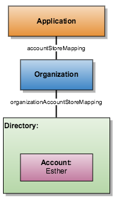
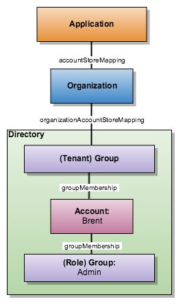
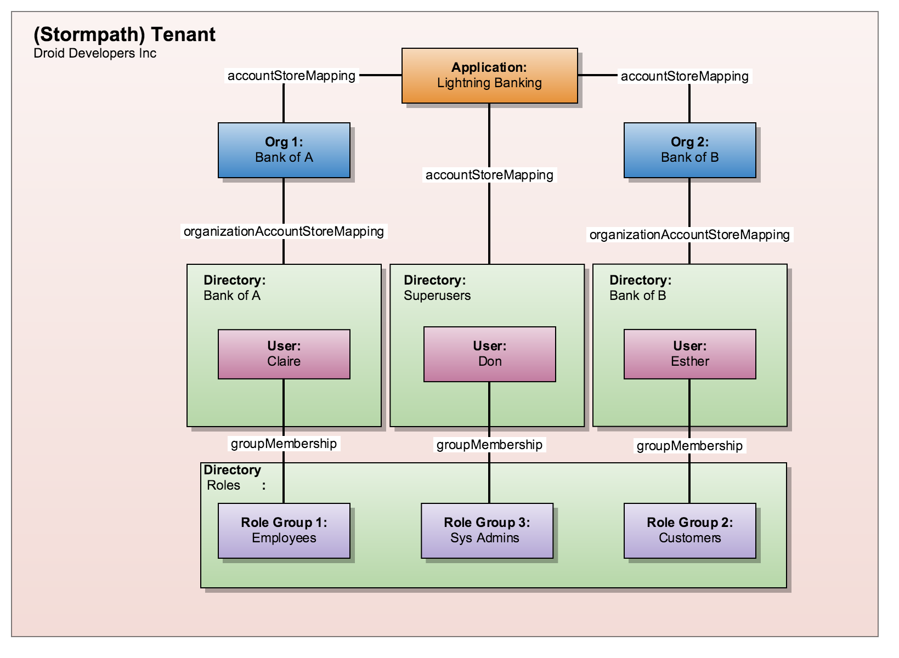
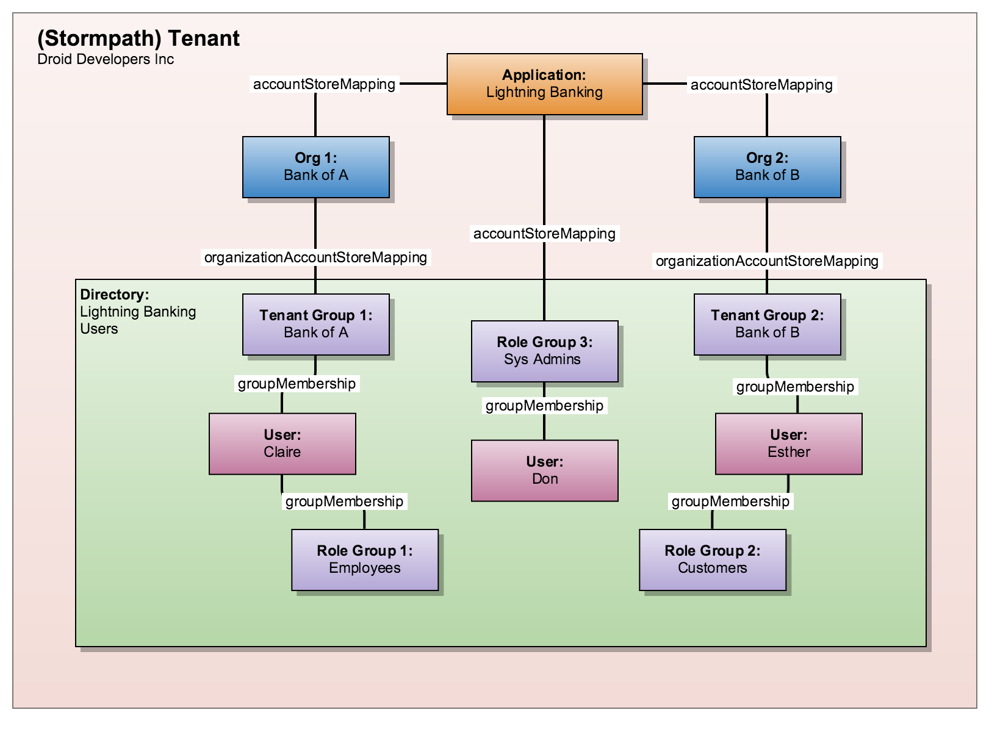

.. _multitenancy:

*******************************
6. Multi-Tenancy with Stormpath
*******************************

6.1. What Is a Multi-Tenant Application?
========================================

Is your application a multi-tenant application? If you already know, then feel free to :ref:`skip this section <multitenancy-modeling>`. If you are unsure, there are two questions that might clarify the issue for you. The first pertains to your application architecture, and the second to your application's relationship to its users.

**Will your application's customers share the same infrastructure?**

The best way to understand this first aspect of multi-tenancy is by thinking of a condo: lots of residents making use of a shared building infrastructure while maintaining their own private and secure living areas. Similar to this, a **multi-tenant application** is a single application infrastructure that services multiple organization tenants simultaneously.

For example, if you are creating your own cloud-based team chat application, you will have multiple organizations connecting to the same servers and databases, and using the same basic application code. The infrastructure, both hardware and software, will be shared among all of your customers.

However, there are plenty of cloud-based services that are not multi-tenant! So now we need to ask another question.

**If your application offered subscriptions, would those be paid by individuals or organizations?**

Perhaps your application will be totally free to use, but don't worry, payment here is simply a way of understand the relationship your users have to your application.

Consider the difference between two internet chat applications: WhatsApp and Slack. When WhatsApp briefly offered a paid subscription, it was paid on a per-account basis. With Slack, an individual user can't pay for a subscription, that has to happen on the Team level. So what's the difference here?

WhatsApp is not a multi-tenant application, because every user's relationship to the application only exists in that simple connection: A user has a WhatsApp account. WhatsApp is a "multi-user" application, but it is not a "multi-tenant" application.

Tenants are organizations of people who use your application in some shared way. So Slack calls their tenants "Teams", and when you log in to Slack you are also logging in to a Team. This also means that a user cannot create an account with Slack, they must create an account with a Slack Team. So, with WhatsApp, a user has a WhatsApp account. With Slack, a user belongs to a Slack Team, and then has an Account within that Team.

If your application is offering (1) shared software and hardware infrastructure to (2) client organizations, then you have a multi-tenant application! Now, for privacy and security purposes, it's very important that your application maintain data segmentation between its multiple tenants. At Stormpath, this segmentation is baked-in to everything that we offer.

.. _multitenancy-modeling:

6.2. Modeling Tenants in Stormpath
===================================

Now that we have an understanding of what a multi-tenant application is we can move on to the next important step, which is understanding how your multi-tenant userbase can be modeled using Stormpath's Data model.

.. note::

  Stormpath's data model is designed to be as flexible (and therefore powerful) as it can be. If at any point you have a question, do not hesitate to `get in touch <support@stormpath.com>`__.

6.2.1 Multi-Tenancy and the Stormpath Data Model
------------------------------------------------

Let's start with a quick overview of the Stormpath resources involved in a multi-tenant data model, starting with the one resource that is purpose-built for multi-tenancy:

**Organizations**

Organizations are the most important modeling resource for multi-tenancy, as each Stormpath Organization maps to one of your application's tenants. They serve as the first point of contact between your Application resource and the rest of your user base, so any login attempts to Stormpath will first be directed to an Organization. The Organization will then in turn use either Directories or Groups to store its user Accounts.

.. warning::

  **Remember:** Stormpath itself is a multi-tenant application, so your Stormpath Tenant resource represents your space within Stormpath.

  Your application's tenants are represented by Organization resources. Do not confuse the two! The Stormpath Tenant has almost no relevance to this multi-tenancy discussion, which is about your application's tenants.

For more about user log-in, see :ref:`multitenancy-auth-to-org` below.

For more information about the Organization resource, see:

- :ref:`multitenancy-why-orgs`
- :ref:`Working With Organizations <multitenancy-organizations>`

**Directories**

Directories are the the top-level Account Store for both Accounts and Groups. All of your Accounts will have to exist inside a Directory. Here is a very simple example of how an Application, Organization and Directory can relate to one another:

  *Application + Organization + Directory*

A few more relevant points about the Directory resource:

- All Accounts within a Directory must have a unique email address
- All Groups within a Directory must have a unique name
- Password and Account Creation Policies are defined on a per-Directory basis
- Emails are configured on a per-Directory basis

Whether you choose to have one Directory for each Organization, or multiple Organizations within one Directory depends on your requirements. More on that distinction can be found :ref:`below <multitenancy-strategies>`.

**Groups**

Groups must always belong to a Directory, but they are otherwise very flexible. Specifically, they have two functions worth mentioning in this context.

- First of all, Groups can be the primary Account Store for your Organization: So you could have one Directory for your application, and then one Group for each tenant Organization. More on this :ref:`below <multitenancy-strategies>`.
- Secondly, Groups can also be used to model user roles, like an "admin" user role. Below you can find a simple diagram with a Group being used both to model a tenant and a role:

  *Application + Organization + Directory*

.. _multitenancy-why-orgs:

Why use Organizations?
^^^^^^^^^^^^^^^^^^^^^^

At this point, it might seem like all your tenants need are Account Stores for their users, so Organizations might seem like an additional and unnecessary layer of complexity. So what is the point of using Organizations?

The Organization resource allows your application's tenants to have as many, or as few, Directories and Groups as they want, while also maintaining strict data segregation. So if a tenant requires a Cloud Directory, a Google Social Directory, and an LDAP Directory, all of these can sit under the umbrella of a single Organization resource that represents their data space in your app.

Although Organizations do not themselves own Accounts in the same way as Directories and Groups, they can be mapped to Applications as Account Stores for the purposes of user log in. This means that they can be used as, among other things, a single-point of access control to an Application. For example, if you wanted to enable login for a new tenant in your multi-tenant application, all you would have to do is map all of the relevant Directories and/or Groups to your Organization, and then map that Organization to your Application as an Account Store. If at some future point you want to disable that tenant, all you have to do is remove the Account Store Mapping between that Organization and your Application, and the tenant's users would no longer be able to log in.

.. _multitenancy-strategies:

6.2.1. Account Store Strategies for Multi-Tenancy
-------------------------------------------------

Your primary consideration when modeling users in Stormpath always begins with the Directory that will contain the user Accounts. With multi-tenancy, you always have one Organization resource for every one of your tenants. The additional consideration is whether each of those Organizations has its own Directory, or whether all Organizations share a single Directory.

To help you decide which strategy is best, answer the following questions:

- **Can a user only sign-up for one tenant with a particular email address?** (As opposed to being able to use the same email address to access multiple tenants)

- **Will your tenants all have different password strength requirements?**

If the answer to either of these questions is "Yes", then you will want to map each Organization to its own Directory. We will call this the :ref:`"Directory per Organization" strategy <multitenancy-dpo>`.

If the answer to either of them is "No", then you will want to have only one Directory, and map each Organization to its own Group. We will call this the :ref:`"Group per Organization" strategy <multitenancy-gpo>`.

The reasoning here is very simple: because Stormpath stores certain things on the Directory resource, if you want each of your tenants to be able to customize things that are stored on the Directory level, then each one will need their own Directory!

.. _multitenancy-dpo:

Strategy 1: Directory per Organization
^^^^^^^^^^^^^^^^^^^^^^^^^^^^^^^^^^^^^^

This first strategy has, as the name implies, one Directory for every tenant Organization. A few questions to think about this for this strategy:

**If a user has signed up for an Account with one of your tenants, are they able to use that same email to create an Account in another tenant?**

All Accounts within a Directory must have a unique ``email``, but no such restriction exists between Directories. So if you want to allow people to use the same email to create separate Accounts for each of your tenants, this is the right strategy.

**Should each tenant have the ability to define their own password strength policy?**

Password Policy is defined off of the Directory, so if each tenant has their own Directory, they also can configure their own Password Policy.

**Should each tenant have the ability to send different emails as part of the user Account creation process?**

The automated emails that Stormpath sends as part of user registration are also defined on the Directory.

**Do you not require application-wide Groups that are available for all tenants?**

Groups exist within Directories, so having Groups associated with multiple tenants is only possible when those tenants as represented as Groups, not Directories.

Directory per Organization Example
""""""""""""""""""""""""""""""""""

Here is an example implementation that uses Directories to model tenants. It is important to note that this is just an example. Stormpath has a very flexible data model with intentionally versatile resources. If you'd like to discuss your particular implementation needs please `get in touch <support@stormpath.com>`_!

    *Directory per Organization ERD.*

.. note::

  Everything discussed occurs inside the private data space that we refer to as your Stormpath Tenant, which is represented by the Tenant resource but does not play any part in multi-tenancy.

The scenario demonstrates a multi-tenant userbase with two tenants, each of which is represented by their own Organization resource. Each tenant Organization in turn uses a Directory as its Account Store. There are a few points to highlight in this diagram:

- The ability to log into the "Lighting Banking" application is controlled by the Account Store Mappings that exist between the Application resource and the Organization resources. To enable or disable a tenant (and its userbase) from logging-in, all you would have to do is enable or disable this Account Store Mapping.
- If Claire wanted to create another Account with Bank of B using the same email address, she would be allowed to, since email uniqueness is enforced only inside a Directory.
- Any role Groups must be created separately, on a per-Directory basis. If you decided to create a new role, a new Group resource representing that role would have to be added to each of your tenant Directories if you wanted the Accounts in that Directory to be able to be assigned that role.
- In order to allow Application Administrators to log in to the app, you'd have to create a new Directory just for them, which is separately mapped to the Application as an Account Store. Since this Directory does not represent a tenant, no Organization resource is created.

.. _multitenancy-gpo:

Strategy 2: Group per Organization
^^^^^^^^^^^^^^^^^^^^^^^^^^^^^^^^^^

The other multi-tenancy option is to have a single Directory under which each of your application's tenants has their own Group. A few questions to think about this for this strategy:

**Do you want to guarantee email and username uniqueness across all tenants?**

With this strategy, all of your user Accounts are contained within the same Directory, so no two Accounts can have the same email address. This means you can create unified cross-tenant user identities, which allows for things like single-sign-on and account sharing between tenants on your application.

**Do all tenants share password and email policies?**

These policies are configured on the Directory. Since all of your tenants will be represented by Groups inside one Directory, they will all share one password policy, and one email policy.

**Do you want to ensure that tenant names are unique?**

Since the Group ``name`` must be unique within a Directory, you can guarantee that your tenants names will not be duplicates.

**You want to have application-wide roles that span across tenants.**

Tenants as Groups Example
"""""""""""""""""""""""""

Below we have an example of an implementation that uses Groups to model tenants. This shows just one possible scenario, and if you'd like to discuss your particular implementation needs please `get in touch <support@stormpath.com>`_!

  *Tenants as Groups ERD*

.. note::

  Once again, everything here is happening inside your private Stormpath Tenant, not to be confused with your application's tenants!

Just as with the Tenants-as-Directories strategy, every Tenant is modeled by its own dedicated Organization, but in this case each Organization uses the same Directory as its Account Store. The different tenant's user Accounts are instead organized using Groups. This all means that:

- You can still control access to the Application by enabling or disabling the Account Store Mappings between the Organizations and the Application resource.
- If Claire tried to create another Account with Bank of B using the same email address she'd used with Bank of A, she would be unable to, since emails must be unique within a Directory.
- If there were a role Group that you wanted to be shared among the tenants, it is as simple as creating one instance of it and then associating Accounts with it.
- Application Administrators just need their own Role Group, which is then mapped as an Account Store with the Application.
- Claire and Esther do not have access to your application's Admin Console, because that is only allowed for members of the "App Admins" role Group. If, however, Claire were hired as an Application Administrator, then she could be easily added to the "App Admins" Group and inherit all of its permissions.

Naming Your Tenant Groups
"""""""""""""""""""""""""

As this is the most common strategy used by our customers, we have found some minor naming conventions that are very powerful and we consider to be best-practice.

First of all, the name of your tenant Organization will have a unique ``nameKey``, for example ``bank-of-a``. This ``nameKey`` this can be used for organizing tenant Groups and sub-Groups.

For example, if your Organization's ``nameKey`` is ``bank-of-a``, you could name the Group ``bank-of-a.tenant``. If you want to create sub-Groups for roles like ``users`` and ``admins``, we recommend that you prepend the ``nameKey`` to their ``name`` Attribute, along with a descriptive name of what kind of Group it is:

``bank-of-a.role.users``

``bank-of-a.role.admin``

This has two benefits:

1. It makes it easy to find all the role Groups for that particular tenant, since you can search for the nameKey:

.. only:: rest

  ``GET https://api.stormpath.com/v1/directories/29E0XzabMwPGluegBqAl0Y/groups?name=bank-of-a.role.*``

.. only:: csharp or vbnet

  .. only:: csharp

    .. literalinclude:: code/csharp/multitenancy/search_groups_by_name_ex1.cs
        :language: csharp

  .. only:: vbnet

    .. literalinclude:: code/vbnet/multitenancy/search_groups_by_name_ex1.vb
        :language: vbnet

.. only:: java

  .. literalinclude:: code/java/multitenancy/search_groups_by_name_ex1.java
      :language: java

.. only:: nodejs

  .. literalinclude:: code/nodejs/multitenancy/search_groups_by_name_ex1.js
      :language: javascript

.. only:: php

  .. literalinclude:: code/php/multitenancy/search_groups_by_name_ex1.php
    :language: php

.. only:: python

  .. literalinclude:: code/python/multitenancy/search_groups_by_name_ex1.py
    :language: python

.. only:: ruby

  .. warning::

    This functionality is not yet available in the Ruby SDK. For updates, please follow `ticket #162 <https://github.com/stormpath/stormpath-sdk-ruby/issues/162>`_ on Github.

  .. todo::

    Add code for searching groups by name field

  .. literalinclude:: code/ruby/multitenancy/search_groups_by_name_ex1.rb
    :language: ruby

Or, if you wanted to retrieve the tenant Group and all of its sub-Groups, make the query a little less restrictive by removing the "role":

.. only:: rest

  ``GET https://api.stormpath.com/v1/directories/29E0XzabMwPGluegBqAl0Y/groups?name=bank-of-a.*``

.. only:: csharp or vbnet

  .. only:: csharp

    .. literalinclude:: code/csharp/multitenancy/search_groups_by_name_ex2.cs
        :language: csharp

  .. only:: vbnet

    .. literalinclude:: code/vbnet/multitenancy/search_groups_by_name_ex2.vb
        :language: vbnet

.. only:: java

  .. literalinclude:: code/java/multitenancy/search_groups_by_name_ex2.java
      :language: java

.. only:: nodejs

  .. literalinclude:: code/nodejs/multitenancy/search_groups_by_name_ex2.js
      :language: javascript

.. only:: php

  .. literalinclude:: code/php/multitenancy/search_groups_by_name_ex2.php
    :language: php

.. only:: python

  .. literalinclude:: code/python/multitenancy/search_groups_by_name_ex2.py
    :language: python

.. only:: ruby

  .. warning::

    This functionality is not yet available in the Ruby SDK. For updates, please follow `ticket #162 <https://github.com/stormpath/stormpath-sdk-ruby/issues/162>`_ on Github.

  .. todo::

    Add code for searching groups by name field

  .. literalinclude:: code/ruby/multitenancy/search_groups_by_name_ex2.rb
    :language: ruby

2. It ensures that no tenant sub-Groups have name collisions between tenants.

.. _multitenancy-organizations:

6.2.2. Working with Organizations
---------------------------------

You will recall that Organizations are umbrella entities that model your tenants in Stormpath, and allow you to better structure and control multi-tenant applications.

.. _create-org:

How to Create an Organization
^^^^^^^^^^^^^^^^^^^^^^^^^^^^^

You can create an Organization in Stormpath by sending the following request:

.. only:: rest

  .. code-block:: http

    POST /v1/organizations HTTP/1.1
    Host: api.stormpath.com

    {
      "name": "Bank of A",
      "nameKey": "bank-of-a",
      "status": "ENABLED"
    }

.. only:: csharp or vbnet

  .. only:: csharp

    .. literalinclude:: code/csharp/multitenancy/create_org_req.cs
        :language: csharp

  .. only:: vbnet

    .. literalinclude:: code/vbnet/multitenancy/create_org_req.vb
        :language: vbnet

  .. note::

    A new Organization resource will have ``null`` Default Account and Group stores. That means adding new Groups and Accounts to the Organization will fail until a default Account Store is added.

.. only:: java

  .. literalinclude:: code/java/multitenancy/create_org_req.java
      :language: java

  .. note::

    A new Organization resource will have ``null`` Default Account and Group stores. That means adding new Groups and Accounts to the Organization will fail until a default Account Store is added.

.. only:: nodejs

  .. literalinclude:: code/nodejs/multitenancy/create_org_req.js
      :language: javascript

.. only:: php

  .. literalinclude:: code/php/multitenancy/create_org_req.php
    :language: php

.. only:: python

  .. literalinclude:: code/python/multitenancy/create_org_req.py
    :language: python

.. only:: ruby

  .. literalinclude:: code/ruby/multitenancy/create_org_req.rb
    :language: ruby

.. only:: rest

  Which would return the following:

  .. code-block:: http

    HTTP/1.1 201 Created
    Location: https://api.stormpath.com/v1/organizations/DhfD17pJrUbsofEXaMPLE
    Content-Type: application/json;charset=UTF-8

    {
      "href": "https://api.stormpath.com/v1/organizations/DhfD17pJrUbsofEXaMPLE",
      "createdAt": "2015-10-02T15:27:01.658Z",
      "modifiedAt": "2015-10-02T15:27:01.658Z",
      "name": "Bank of A",
      "nameKey": "bank-of-a",
      "status": "ENABLED",
      "description": null,
      "customData": {
        "href": "https://api.stormpath.com/v1/organizations/DhfD17pJrUbsofEXaMPLE/customData"
      },
      "defaultAccountStoreMapping": null,
      "defaultGroupStoreMapping": null,
      "accountStoreMappings": {
        "href": "https://api.stormpath.com/v1/organizations/DhfD17pJrUbsofEXaMPLE/accountStoreMappings"
      },
      "groups": {
        "href": "https://api.stormpath.com/v1/organizations/DhfD17pJrUbsofEXaMPLE/groups"
      },
      "accounts": {
        "href": "https://api.stormpath.com/v1/organizations/DhfD17pJrUbsofEXaMPLE/accounts"
      },
      "tenant": {
        "href": "https://api.stormpath.com/v1/tenants/1gBTncWsp2ObQGgexAMPLE"
      }
    }

  Notice here that both the Default Account Store and Group Store are ``null`` which means that Groups and Accounts added to the Organization (e.g. A POST to ``/v1/organizations/$ORGANIZATION_ID/groups``) would fail until a default Account Store is added.

.. only:: nodejs

  Which would return the following:

  .. literalinclude:: code/nodejs/multitenancy/create_org_resp.js
      :language: javascript

.. only:: php

  Which would return the following:

  .. literalinclude:: code/php/multitenancy/create_org_resp.php
    :language: php

  Notice here that both the Default Account Store and Group Store are ``NULL`` which means that Groups and Accounts added to the Organization would fail until a default Account Store is added.

.. only:: python and ruby

  Which would return a new Organization object.

Adding an Account Store to an Organization
^^^^^^^^^^^^^^^^^^^^^^^^^^^^^^^^^^^^^^^^^^

An Organization can be mapped to an Application so that users in the Organization can log-in to that application. Before you do this, you must first associate some users with the Organization so that there is someone to log in! To do this, you have to map some Account Stores to your Organization.

.. only:: rest

  First, you will need the ``href`` value for a Directory or Group. This, combined with the ``href`` of the Organization will be sent in a request:

  .. code-block:: http

    POST /v1/organizationAccountStoreMappings HTTP/1.1
    Host: api.stormpath.com
    Content-Type: application/json;charset=UTF-8

    {
      "organization": {
        "href": "https://api.stormpath.com/v1/organizations/DhfD17pJrUbsofEXaMPLE"
      },
      "accountStore": {
        "href": "https://api.stormpath.com/v1/groups/2SKhstu8Plaekcaexample"
      }
    }

  These two attributes, ``organization`` and ``accountStore`` are required, though you may add some optional attributes as well:

  - ``listIndex``: Represents the priority in which this accountStore will be consulted by the Organization during an authentication attempt. This is a zero-based index, meaning that an Account Store at ``listIndex`` of 0 will be consulted first, followed by the Account Store at listIndex 1, etc. Setting a negative value will default the value to 0, placing it first in the list. A listIndex of larger than the current list size will place the mapping at the end of the list and then default the value to (list size – 1).

  - ``isDefaultAccountStore``: A ``true`` value indicates that new Accounts created by the Organization’s ``/accounts`` endpoint will be automatically saved to this mapping’s Directory or Group.

  - ``isDefaultGroupStore``: A ``true`` value indicates that new Groups created by the Organization’s ``/groups`` endpoint will be automatically saved to this mapping’s Directory. Note that a ``true`` value will only be valid here if the accountStore is a Directory.

.. only:: csharp or vbnet

  .. only:: csharp

    .. literalinclude:: code/csharp/multitenancy/asm_to_org.cs
        :language: csharp

  .. only:: vbnet

    .. literalinclude:: code/vbnet/multitenancy/asm_to_org.vb
        :language: vbnet

.. only:: java

  .. literalinclude:: code/java/multitenancy/asm_to_org.java
      :language: java

.. only:: nodejs

  .. literalinclude:: code/nodejs/multitenancy/asm_to_org.js
      :language: javascript

.. only:: php

  .. literalinclude:: code/php/multitenancy/asm_to_org.php
    :language: php

  These two attributes, ``organization`` and ``accountStore`` are required, though you may add some optional attributes as well:

  - ``listIndex``: Represents the priority in which this accountStore will be consulted by the Organization during an authentication attempt. This is a zero-based index, meaning that an Account Store at ``listIndex`` of 0 will be consulted first, followed by the Account Store at listIndex 1, etc. Setting a negative value will default the value to 0, placing it first in the list. A listIndex of larger than the current list size will place the mapping at the end of the list and then default the value to (list size – 1).

  - ``isDefaultAccountStore``: A ``true`` value indicates that new Accounts created by the Organization’s ``/accounts`` endpoint will be automatically saved to this mapping’s Directory or Group.

  - ``isDefaultGroupStore``: A ``true`` value indicates that new Groups created by the Organization’s ``/groups`` endpoint will be automatically saved to this mapping’s Directory. Note that a ``true`` value will only be valid here if the accountStore is a Directory.

.. only:: python

  .. literalinclude:: code/python/multitenancy/asm_to_org.py
    :language: python

  These two attributes, ``organization`` and ``account_store`` are required, though you may add some optional attributes as well:

  - ``listIndex``: Represents the priority in which this account_store will be consulted by the Organization during an authentication attempt. This is a zero-based index, meaning that an Account Store at ``listIndex`` of 0 will be consulted first, followed by the Account Store at listIndex 1, etc. Setting a negative value will default the value to 0, placing it first in the list. A listIndex of larger than the current list size will place the mapping at the end of the list and then default the value to (list size – 1).

  - ``is_default_account_store``: A ``True`` value indicates that new Accounts created by the Organization’s ``/accounts`` endpoint will be automatically saved to this mapping’s Directory or Group.

.. only:: ruby

  .. literalinclude:: code/ruby/multitenancy/asm_to_org.rb
    :language: ruby

  These two attributes, ``organization`` and ``account_store`` are required, though you may add some optional attributes as well:

  - ``listIndex``: Represents the priority in which this account_store will be consulted by the Organization during an authentication attempt. This is a zero-based index, meaning that an Account Store at ``listIndex`` of 0 will be consulted first, followed by the Account Store at listIndex 1, etc. Setting a negative value will default the value to 0, placing it first in the list. A listIndex of larger than the current list size will place the mapping at the end of the list and then default the value to (list size – 1).

  - ``is_default_account_store``: A ``true`` value indicates that new Accounts created by the Organization’s ``/accounts`` endpoint will be automatically saved to this mapping’s Directory or Group.

.. only:: not nodejs

  In order to be able to add Groups and Accounts to the Organization in the way mentioned above, we should also make sure that we mark this Account Store as our default for both Accounts and Groups:

.. only:: nodejs

  In order to be able to add Groups and Accounts to the Organization in the way mentioned above, we've marked this Account Store as our default for both Accounts and Groups by passing the ``isDefaultAccountStore`` and ``isDefaultGroupStore`` options.

.. only:: rest

  .. code-block:: http

    POST /v1/organizationAccountStoreMappings HTTP/1.1
    Host: api.stormpath.com
    Content-Type: application/json;charset=UTF-8

    {
      "organization": {
        "href": "https://api.stormpath.com/v1/organizations/DhfD17pJrUbsofEXaMPLE"
      },
      "accountStore": {
        "href": "https://api.stormpath.com/v1/groups/2SKhstu8Plaekcaexample"
      },
      "isDefaultAccountStore":true,
      "isDefaultGroupStore":true
    }

.. only:: csharp or vbnet

  .. only:: csharp

    .. literalinclude:: code/csharp/multitenancy/asm_to_org_with_default_req.cs
        :language: csharp

  .. only:: vbnet

    .. literalinclude:: code/vbnet/multitenancy/asm_to_org_with_default_req.vb
        :language: vbnet

.. only:: java

  .. literalinclude:: code/java/multitenancy/asm_to_org_with_default_req.java
      :language: java

.. only:: php

  .. literalinclude:: code/php/multitenancy/asm_to_org_with_default_req.php
    :language: php

.. only:: python

  .. literalinclude:: code/python/multitenancy/asm_to_org_with_default_req.py
    :language: python

.. only:: ruby

  .. literalinclude:: code/ruby/multitenancy/asm_to_org_with_default_req.rb
    :language: ruby

.. only:: rest

  Which would result in the following response:

  .. code-block:: http

    HTTP/1.1 201 Created
    Location: https://api.stormpath.com/v1/organizationAccountStoreMappings/3e9cNxhX8abxmPWexAMPle"
    Content-Type: application/json;charset=UTF-8

    {
      "href": "https://api.stormpath.com/v1/organizationAccountStoreMappings/3e9cNxhX8abxmPWexAMPle",
      "listIndex": 0,
      "isDefaultAccountStore": true,
      "isDefaultGroupStore": true,
      "organization": {
        "href": "https://api.stormpath.com/v1/organizations/DhfD17pJrUbsofEXaMPLE"
      },
      "accountStore": {
        "href": "https://api.stormpath.com/v1/groups/2SKhstu8Plaekcaexample"
      }
    }

.. only:: php

  Which would result in the following response:

  .. literalinclude:: code/php/multitenancy/asm_to_org_with_default_resp.php
    :language: php

.. only:: csharp or vbnet

  A mapping between an Organization and an Account Store is represented by an ``IOrganizationAccountStoreMapping`` object. There are a few optional properties that can be set:

  - ``ListIndex``: Represents the priority in which this Account Store will be consulted by the Organization during an authentication attempt. This is a zero-based index, meaning that an Account Store at ``ListIndex`` of 0 will be consulted first, followed by the Account Store at index 1, etc. Setting a negative value will default the value to 0, placing it first in the list. An index larger than the current list size will place the mapping at the end of the list and then set the value to (list size – 1).

  - ``IsDefaultAccountStore``: A ``true`` value indicates that new Accounts created in the Organization will be automatically saved to this mapping’s Directory or Group.

  - ``IsDefaultGroupStore``: A ``true`` value indicates that new Groups created in the Organization will be automatically saved to this mapping’s Directory. Note that a ``true`` value will only be valid here if the Account Store is a Directory.

  This example sets all the properties of the Organization Account Store Mapping at creation time:

  .. only:: csharp

    .. literalinclude:: code/csharp/multitenancy/create_oasm_full_req.cs
        :language: csharp

  .. only:: vbnet

    .. literalinclude:: code/vbnet/multitenancy/create_oasm_full_req.vb
        :language: vbnet

.. only:: java

  A mapping between an Organization and an Account Store is represented by an ``OrganizationAccountStoreMapping`` object. There are a few optional properties that can be set:

  - ``listIndex``: Represents the priority in which this Account Store will be consulted by the Organization during an authentication attempt. This is a zero-based index, meaning that an Account Store at ``ListIndex`` of 0 will be consulted first, followed by the Account Store at index 1, etc. Setting a negative value will default the value to 0, placing it first in the list. An index larger than the current list size will place the mapping at the end of the list and then set the value to (list size – 1).

  - ``defaultAccountStore``: A ``true`` value indicates that new Accounts created in the Organization will be automatically saved to this mapping’s Directory or Group.

  - ``defaultGroupStore``: A ``true`` value indicates that new Groups created in the Organization will be automatically saved to this mapping’s Directory. Note that a ``true`` value will only be valid here if the Account Store is a Directory.

  This example sets all the properties of the Organization Account Store Mapping at creation time:

  .. literalinclude:: code/java/multitenancy/create_oasm_full_req.java
      :language: java

Our Organization now has an associated Directory which can be used as an Account Store to add new Accounts and Groups. To enable login for the Accounts in this Organization, we must now map the Organization to an Application.

Registering an Organization as an Account Store for an Application
^^^^^^^^^^^^^^^^^^^^^^^^^^^^^^^^^^^^^^^^^^^^^^^^^^^^^^^^^^^^^^^^^^

As described in :ref:`the Authentication chapter <authn>`, in order to allow users to log-in to an Application, you must map some kind of Account Store to it. One approach is to go one-by-one and map each Directory and/or Group to the Application. However, since we are building a multi-tenant app, and the Organization is itself an Account Store, we can just map our Organization resource to our Application resource. This would enable login for all of the Directories and Groups currently inside that Organization, as well as any we add in the future.

To map an Organization to an Application, follow the steps you would for any Account Store, as described in :ref:`create-asm`.

.. _add-accnt-to-org:

Adding an Account to an Organization
^^^^^^^^^^^^^^^^^^^^^^^^^^^^^^^^^^^^^^^^^

Adding a new Account to an Organization is exactly the same as adding them to a Directory, except that you use the Organization to handle the creation request:

.. only:: rest

  .. code-block:: http

    POST /v1/organizations/2P4XOanz26AUomIexAmple/accounts HTTP/1.1
    Host: api.stormpath.com
    Content-Type: application/json;charset=UTF-8

    {
        "givenName": "Annie",
        "surname": "Nguyen",
        "username": "annie@nguyengland.me",
        "email": "annie@nguyengland.me",
        "password":"Changeme1",
        "customData": {
            "favoriteColor": "fuschia"
        }
    }

.. only:: csharp or vbnet

  .. only:: csharp

    .. literalinclude:: code/csharp/multitenancy/add_account_to_org.cs
        :language: csharp

  .. only:: vbnet

    .. literalinclude:: code/vbnet/multitenancy/add_account_to_org.vb
        :language: vbnet

.. only:: java

  .. literalinclude:: code/java/multitenancy/add_account_to_org.java
      :language: java

.. only:: nodejs

  .. literalinclude:: code/nodejs/multitenancy/add_account_to_org.js
    :language: javascript

.. only:: php

  .. literalinclude:: code/php/multitenancy/add_account_to_org.php
    :language: php

.. only:: python

  .. literalinclude:: code/python/multitenancy/add_account_to_org.py
    :language: python

.. only:: ruby

  .. warning::

    This functionality is not yet available in the Ruby SDK. For updates, please follow `ticket #167 <https://github.com/stormpath/stormpath-sdk-ruby/issues/167>`_ on Github.

  .. todo::

    (ruby.todo)

  .. literalinclude:: code/ruby/multitenancy/add_account_to_org.rb
    :language: ruby

.. _multitenancy-auth-to-org:

6.3. Authenticating an Account against an Organization
======================================================

Authenticating an Account against an Organization works essentially the same way as described in :ref:`how-login-works`. The only difference is that adding the Organization resource allows for an additional level of Account Stores.

When a login attempt is made against an Application’s ``/loginAttempts`` endpoint without specifying an Account Store, Stormpath will iterate through the index of Account Stores mapped to the Application, in priority order. For every Account Store entry:

- If it is a Directory or Group, attempt to log in on that resource.

- If it is an Organization:

  - Iterate through the index of Account Stores mapped to the Organization, in priority order. For every Account Store entry:

    - If it is a Directory or Group, attempt to log in on that resource.

If the login attempt does specify an Organization, then we simply jump to that point in the steps, and the Organization's Account Stores are iterated through as described above.

.. _multitenancy-routing-users:

6.4 Routing Users to their Tenant
==================================

If you are designing a public multi-tenant web application that supports multiple application tenants with private data partitioning, then you will probably want some way for users to specify which tenant they are logging in to.

This tenant selection also extends to the requests that the user makes. For example, let's say we have a multi-tenant e-commerce SaaS application that shows purchase history. If a user requests the ``/purchases`` view, they should only be able to see the purchases specific to their organization. This means that instead of executing a query like this to a database:

.. code-block:: sql

  SELECT * from purchases;

The application needs to know the request user’s tenant identifier so they can show only the purchases for that tenant. The application might instead execute the following query:

.. code-block:: sql

  SELECT * from purchases where tenant_id = ?;

where ``?`` is the ``tenant_id`` value obtained by inspecting the request.

So if an application needs this identifier with every request, how do you ensure it is transmitted to the application in the easiest possible way for your end users? The best method is to use the :ref:`Organization resource <ref-organization>` and it's ``nameKey`` attribute.

.. note::

  Stormpath's ID Site supports multi-tenancy right out of the box. For more information about how to handle user login in a multi-tenant set-up with ID Site, please see :ref:`the ID Site chapter <idsite-multitenancy>`.

We present here two possible solutions that use this ``nameKey``. You may support both if you wish to give your customers convenience options.

6.4.1. Sub-Domain
------------------------

The first solution is to allow your users to access your application via a unique subdomain URL:

``https://organizationNameKey.myapplication.io``

The primary benefit here is that the application never needs to ask the user for the tenant identifier, because it is inherently part of every request in the ``HOST`` header. Also, since we are using the Organization resource's ``nameKey``, we can guarantee that the URL is unique.

There are also a few other things that we recommend with this approach:

Separate Domain Space
^^^^^^^^^^^^^^^^^^^^^

Keep your customer organization subdomains space completely separate from your company's subdomain space by using a different top-level domain name for your SaaS application.

So if your company's website URL is ``http://mycompany.com``, then your customers could use the ``http://mycompany.io`` domain space:

``http://customerA.mycompany.io``

If you use the same domain space, it is possible that one of your customer's will end up using a subdomain that you might want to use for your company.

If you didn't want to use a separate top-level domain, you could also use sub-subdomains. For example, the app could be accessible here:

``http://myapp.mycompany.com``

And customer organization subdomains for that app would be accessible via:

``http://customerA.myapp.mycompany.com``

It is our opinion that the separate top-level domain (e.g. ``http://mycompany.io``) is the nicer alternative: it is shorter, easier to remember, easier to type, and it also looks better.

Combine With Login Form Field
^^^^^^^^^^^^^^^^^^^^^^^^^^^^^

If a user from a customer organization ever accesses your app directly (``https://mycompany.io``) instead of using their subdomain (``https://customerA.mycompany.io``), you still might need to provide a tenant-aware login form (described below). After login, you can redirect them to their tenant-specific URL for all subsequent requests.

6.4.2. Login Form Field
------------------------

An alternative, or complimentary, approach to tenant subdomains is to allow the user to specify their tenant on the login page, then storing that information. Then, for all subsequent requests to your application, you can:

- Inspect the session
- Look up the tenant ID
- Customize data views and queries based on the session's Organization

We advise that you auto-remember the login form tenant ID value so that field is pre-populated whenever a user returns to log in. Users don’t like having to remember and type that value in every time they log in.

As already mentioned, it is strongly recommended that your tenant identifier be an Organization ``nameKey``. Firstly because Organizations are the recommended resource to use to model multi-tenancy, but also because the ``nameKey`` attribute is unique and follows the DNS specification, which means that you could at any time adopt the Sub-Domain approach mentioned above.

Stormpath supports quick implementation of all of these strategies with ID Site. For more information, please see :ref:`the ID Site chapter <idsite-multitenancy>`.
