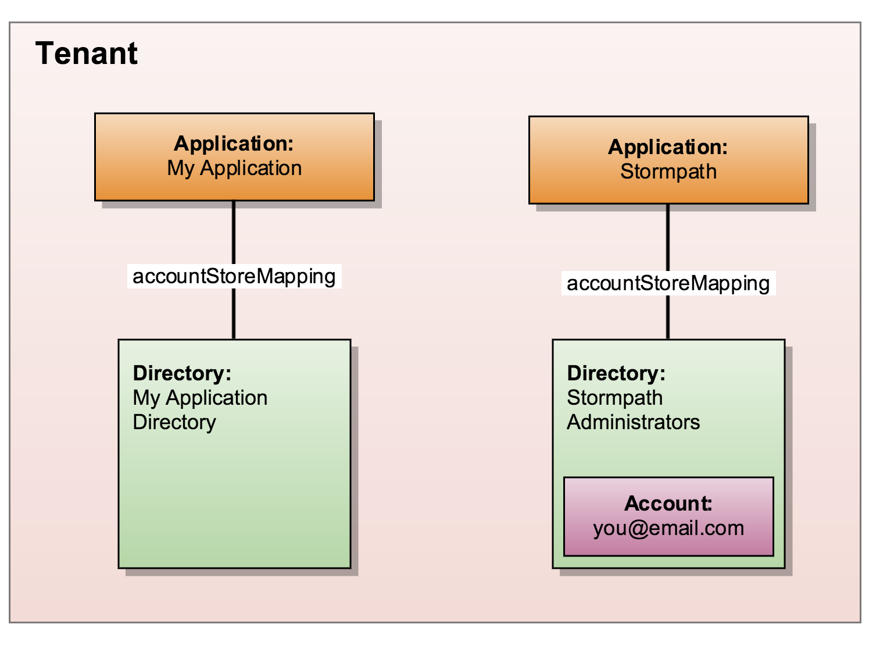

.. _quickstart:

**************
2. Quickstart
**************

Now that you've decided that Stormpath is right for you, let's get you set up and working with Stormpath. This quickstart will begin with signing you up for Stormpath, and will end with you authenticating a newly created user.

If you have already signed-up for Stormpath and downloaded an API Key, you can jump to:

.. only:: not rest

  - :ref:`Installing the SDK <quickstart-install-sdk>`

- :ref:`Retrieve Your Application <quickstart-retrieve-app>`

.. _quickstart-signup:

2.1 Sign-up for Stormpath
=========================

1. Go to https://api.stormpath.com/register and complete the form.
2. You will receive a confirmation email with an activation link.
3. Once you click the link, Stormpath will create a Stormpath account along with a Tenant. Your Tenant name will be a unique pair of two randomly-generated words separated by a hyphen (e.g. "iron-troop").

.. note::

  Note your tenant name! You will need this in the future in order to log-in to your Stormpath Admin Console.

4. On this screen, re-enter your password and click "Log In" to enter the Admin Console. From here you will be able to perform all of the administrative functions required for your Stormpath Account. You should start by creating an API key.

.. _quickstart-create-apikey:

2.2 Create an API Key Pair
===========================

In order to use the Stormpath API, you will need an API key. To get one, follow these steps:

1. On the right side of the Admin Console, under "Developer Tools", click the "Create API Key" button.

2. A dialog box will come up, with additional information about the key. You will now be able to download your key in the form of a ``apiKey.properties`` file. This file contains your Stormpath API Key information, which can be used to authenticate with the Stormpath API.

.. note::

  Your API Key should be stored in a secure location. For example, you could place it in a hidden ``stormpath`` directory:

  .. code-block:: bash

    $ mkdir ~/.stormpath
    $ mv ~/Downloads/apiKey.properties ~/.stormpath/

  We also recommend that you change the file's permissions to prevent access by other users. You can do this by running:

  .. code-block:: bash

    $ chmod go-rwx ~/.stormpath/apiKey.properties

.. only:: not rest

  .. _quickstart-install-sdk:

  2.3 Installing the SDK
  ======================

  .. only:: csharp or vbnet

    To set up your environment follow these steps:

    First, create a new Console Application project in Visual Studio. Install the Stormpath .NET SDK by running

      ``install-package Stormpath.SDK``

    in the Package Manager Console. If you prefer, you can also use the NuGet Package Manager to install the Stormpath.SDK package.

    Next, add these statements at the top of your code:

    .. only:: csharp

      .. literalinclude:: code/csharp/quickstart/using.cs
        :language: csharp

      .. only:: vbnet

        .. literalinclude:: code/vbnet/quickstart/using.vb
          :language: vbnet

    Asynchronous and Synchronous Support
    ------------------------------------

    The Stormpath .NET SDK supports the `Task-based asynchronous <https://msdn.microsoft.com/en-us/library/hh873175(v=vs.110).aspx>`_ model by default. Every method that makes a network call ends in ``Async``, takes an optional ``CancellationToken`` parameter, and can be awaited.

    The built-in Visual Studio Console Application template doesn't support making asynchronous calls, but that's easy to fix:

      .. only:: csharp

        .. literalinclude:: code/csharp/quickstart/async_fix.cs
          :language: csharp

      .. only:: vbnet

        .. literalinclude:: code/vbnet/quickstart/async_fix.vb
          :language: vbnet

    The ``Stormpath.SDK.Sync`` namespace can be used in older applications or situations where synchronous access is required. This namespace provides a synchronous counterpart to each asynchronous method.

    .. note::
      The asynchronous API is preferred for newer applications. However, the methods available in ``Stormpath.SDK.Sync`` are **natively** synchronous - not just a blocking wrapper over the asynchronous API. These methods can be used safely, even from asynchronous applications.

  .. only:: python

    To set up your environment follow these steps:

    First, install the Stormpath Python SDK by running the following command on
    the terminal:

    .. code:: console

      pip install stormpath

    If you'd like to update to use the latest Stormpath Python SDK, you can
    instead run:

    .. code:: console

      pip install --upgrade stormpath

  .. only:: java

    To setup your environment for this quickstart, follow these steps:

    Include the following dependencies in your Maven ``pom.xml`` file:

    .. code-block:: xml

      ...

      <dependencies>

          ...

          <dependency>
              <groupId>com.stormpath.sdk</groupId>
              <artifactId>stormpath-sdk-api</artifactId>
              <version>###latest_stormpath_version###</version>
          </dependency>
          <dependency>
              <groupId>com.stormpath.sdk</groupId>
              <artifactId>stormpath-sdk-httpclient</artifactId>
              <version>###latest_stormpath_version###</version>
              <scope>runtime</scope>
          </dependency>

          ...

      </dependencies>

      ...

  .. only:: nodejs

    To set up your environment follow these steps:

    First, install the Stormpath Node.js SDK by running the following command on
    the terminal:

    .. code:: console

      npm install stormpath

.. only:: rest

  These instructions assume that you have `cURL <http://curl.haxx.se/download.html>`_ installed on your system and that you have already completed the steps above, and now have:

.. only:: csharp or vbnet

  These instructions assume that you have Visual Studio installed on your system and that you have already completed the steps above, and now have:

.. only:: python

  These instructions assume that you have
  `pip <http://pip.readthedocs.org/en/stable/>`_ installed on your system and
  that you have already completed the steps above, and now have:

.. only:: java

  These instructions assume that you have
  `java <http://java.com>`_ and `maven <https://maven.apache.org/index.html>`_ installed on your system and that you have
  already completed the steps above, and now have:

- A Stormpath account
- A Stormpath API Key generated and downloaded onto your system
- A Stormpath Tenant resource. The following associated resources were also automatically created:
  - Two Application resources: One called "My Application", and the other called "Stormpath"
  - Two Directory resources: "My Application Directory" and "Stormpath Administrators"
  - "My Application Directory" is set as the default Directory for any new Accounts added to "My Application".
  - An Account resource representing your Stormpath Administrator user.

  *These are the default resources that exist in your Tenant right after registration*

In this section of the quickstart, you will:

- :ref:`Retrieve your Application <quickstart-retrieve-app>`.
- :ref:`Create a User Account <quickstart-create-account>`.
- :ref:`Authenticate a User Account <quickstart-auth-user>`.

Stormpath also can do a lot more (like :ref:`Groups <group-mgmt>`, :ref:`Multitenancy <multitenancy>`, and :ref:`Social Integration <social-authn>`) which you can learn more about later in this guide.

Let's get started!

.. _quickstart-retrieve-app:

.. only:: not rest

  2.4. Retrieve Your Application
  ===============================

.. only:: rest

  2.3. Retrieve Your Application
  ===============================

Before you can create user Accounts, you'll need to retrieve your Stormpath Application. An Application in Stormpath represents the project that you are working on. This means that, if you're building a web app named "Lightsabers Galore", you'd want to name your Stormpath Application "Lightsabers Galore" as well. By default, your Stormpath Tenant will have an Application already created for you to use. We will use this Application, named "My Application", for the quickstart.

.. only:: csharp or vbnet

  The first thing you need to connect to the Stormpath API is an ``IClient`` object:

  .. only:: csharp

    .. literalinclude:: code/csharp/quickstart/initialize_client.cs
      :language: csharp

  .. only:: vbnet

    .. literalinclude:: code/vbnet/quickstart/initialize_client.vb
      :language: vbnet

  .. note::

    You can skip building the ``IClientApiKey`` object and the call to ``SetApiKey()`` if you store your API Key and Secret in environment variables, or put the ``apiKey.properties`` file in the default location (``~\.stormpath\apiKey.properties``). Calling ``IClientBuilder.Build()`` without specifying an API Key will check the default location.

  Once you have an ``IClient`` instance, keep it around! You should only create it **once** per application. It's thread-safe, so you can safely reuse it, even in an ASP.NET application.

.. only:: python

  The first thing you need to connect to the Stormpath API is a ``Client`` object:

  .. literalinclude:: code/python/quickstart/initialize_client.py
    :language: python

  Once you have a ``Client`` instance, keep it around! You should only create it **once** per application.  It maintains its own cache, so you only want to generate a single Client instance for any application.

.. only:: java

  .. note::

    The following assumes that you have a file name: ``~/.stormpath/apiKey.properties`` that contains your api key id and your api key secret in this format:

    .. code-block:: console

      apiKey.id = <your api key id>
      apiKey.secret = <your api key secret>

  The first thing you need to connect to the Stormpath API is a ``Client`` object:

  .. literalinclude:: code/java/quickstart/initialize_client.java
    :language: java

  Once you have a ``Client`` instance, keep it around! You should only created it **once** per application. It maintains its own cache, so you only want to generate a single Client instance for any application.

.. only:: nodejs

  The first thing you need to connect to the Stormpath API is a ``Client`` object:

  .. literalinclude:: code/nodejs/quickstart/initialize_client.js
    :language: javascript

  Once you have a ``Client`` instance, keep it around! You should only create it **once** per application. It maintains its own cache, so you only want to generate a single Client instance for any application.

.. only:: rest

  Before you can get your Application, you must get the location of your Tenant from Stormpath, like so:

.. only:: rest

  .. code-block:: bash

    curl --request GET \
      --user $SP_API_KEY_ID:$SP_API_KEY_SECRET \
      --header 'content-type: application/json' \
      --url "https://api.stormpath.com/v1/tenants/current"

  -  ``$SP_API_KEY_ID`` is the ``apiKey.id`` value in
     ``apiKey.properties`` and
  -  ``$SP_API_KEY_SECRET`` is the ``apiKey.secret`` value in
     ``apiKey.properties``

  The above cURL command returns an empty body along with a header:

  .. code-block:: http

    HTTP/1.1 302 Found
    Location: https://api.stormpath.com/v1/tenants/$TENANT_ID
    Content-Length: 0

  Make note of the ``Location`` header. This is the location of your Tenant in Stormpath, which you will need in the next step.

  From here, using the location of the Tenant, you can get your Application by performing a search for the Application by name, with $TENANT_HREF replaced with the ``href`` of your Tenant from the previous cURL:

  .. code-block:: bash

    curl --request GET \
      --user $SP_API_KEY_ID:$SP_API_KEY_SECRET \
      --header 'content-type: application/json' \
      --url "https://api.stormpath.com/v1/tenants/yOuRTeNANtid/applications?name=My%20Application"

  .. note::

    If you leave off the ``?name=My%20Application'`` query at the end of the request, it will instead retrieve a list of all Applications for this Tenant.

  The above cURL would return this example response:

  .. code-block:: json
    :emphasize-lines: 2,12,13,21,22

    {
      "href":"https://api.stormpath.com/v1/applications/1gk4Dxzi6o4PbdlEXampLE",
      "name":"My Application",
      "description":"This application was automatically created for you in Stormpath for use with our Quickstart guides(https://docs.stormpath.com). It does apply to your subscription's number of reserved applications and can be renamed or reused for your own purposes.",
      "status":"ENABLED",
      "createdAt":"2015-08-18T20:46:36.061Z",
      "modifiedAt":"2015-11-09T21:09:34.334Z",
      "tenant":{
        "href":"https://api.stormpath.com/v1/tenants/1gBTncWsp2ObQGgDn9R91R"
      },
      "comment":" // This JSON has been truncated for readability",
      "accounts":{
        "href":"https://api.stormpath.com/v1/applications/1gk4Dxzi6o4PbdlEXampLE/accounts"
      },
      "groups":{
        "href":"https://api.stormpath.com/v1/applications/1gk4Dxzi6o4PbdlEXampLE/groups"
      },
      "accountStoreMappings":{
        "href":"https://api.stormpath.com/v1/applications/1gk4Dxzi6o4PbdlEXampLE/accountStoreMappings"
      },
      "loginAttempts":{
        "href":"https://api.stormpath.com/v1/applications/1gk4Dxzi6o4PbdlEXampLE/loginAttempts"
      },
      "comment":" // This JSON has been truncated for readability"
    }

  Make note of the ``accounts``, ``loginAttempts``, and ``href`` URLs in the above response. We're now going to use these to create a new user Account and then authenticate it.

.. only:: php

  .. literalinclude:: code/php/quickstart/retrieve_your_application.php
    :language: php

.. only:: java

  Next, use the ``getApplications`` method on the ``Client`` and use criteria to search for the "My Application" Application:

  .. literalinclude:: code/java/quickstart/retrieve_your_application.java
    :language: java

.. only:: csharp or vbnet

  Next, use the ``GetApplications()`` collection to search for the "My Application" Application:

  .. only:: csharp

    .. literalinclude:: code/csharp/quickstart/retrieve_your_application.cs
      :language: csharp

  .. only:: vbnet

    .. literalinclude:: code/vbnet/quickstart/retrieve_your_application.vb
      :language: vbnet

  .. note::

    ``GetApplications()`` returns an ``IAsyncQueryable``, which represents a Stormpath collection resource that can be queried using LINQ-to-Stormpath. No network request is made to the Stormpath API until you call a method that enumerates the collection, such as ``SingleAsync()`` or ``ToListAsync()``.

    **Tip**: If you're using the ``Stormpath.SDK.Sync`` namespace, call the ``Synchronously()`` method after calling ``GetApplications()``. Then use standard LINQ result operators like ``Single()`` to synchronously execute the query.

  ``myApp`` is an ``IApplication`` object, which represents a Stormpath Application resource as a .NET type. We'll use this object to create a new user Account and then authenticate it.

.. only:: python

  Next, use the ``client.applications`` generator to search for the "My
  Application" Application:

  .. literalinclude:: code/python/quickstart/retrieve_your_application.py
    :language: python

  ``application`` is an ``Application`` object, which represents a Stormpath
  Application resource as a Python class.  We'll use this object to create a
  new user Account and then authenticate it.

.. only:: nodejs

  Next, use the ``client.getApplications`` method to search for the "My
  Application" Application:

  .. literalinclude:: code/nodejs/quickstart/retrieve_your_application.js
    :language: javascript

  ``application`` is an ``Application`` object, which represents a Stormpath
  Application resource.  We'll use this object to create a new user Account
  and then authenticate it.

.. _quickstart-create-account:

.. only:: not rest

  2.5. Create a User Account
  ==========================

.. only:: rest

  2.4. Create a User Account
  ==========================

Now that we've created an Application, let's create a user Account so someone can log in to (i.e. authenticate with) the Application.

.. only:: rest

  .. code-block:: bash

    curl --request GET \
      --user $SP_API_KEY_ID:$SP_API_KEY_SECRET \
      --header 'content-type: application/json' \
      --url "https://api.stormpath.com/v1/applications/1gk4Dxzi6o4PbdlEXampLE/accounts"
      --data '{
      "givenName": "Joe",
      "surname": "Stormtrooper",
      "username": "tk421",
      "email": "tk421@stormpath.com",
      "password":"Changeme1",
      }'

  This would return this response:

  .. code-block:: json

    {
      "href": "https://api.stormpath.com/v1/accounts/2wufAnDszC3PRi9exAMple",
      "username": "tk421",
      "email": "tk421@stormpath.com",
      "fullName": "Joe Stormtrooper",
      "givenName": "Joe",
      "middleName": null,
      "surname": "Stormtrooper",
      "status": "ENABLED",
      "customData": {
        "href":"https://api.stormpath.com/v1/accounts/2wufAnDszC3PRi9exAMple/customData"
      },
      "groups": {
        "href":"https://api.stormpath.com/v1/accounts/2wufAnDszC3PRi9exAMple/groups"
      },
      "groupMemberships": {
        "href":"https://api.stormpath.com/v1/accounts/2wufAnDszC3PRi9exAMple/groupMemberships"
      },
      "directory": {
        "href":"https://api.stormpath.com/v1/directories/1gkPqEScsMQSUFreXAMPLE"
      },
      "tenant": {
        "href":"https://api.stormpath.com/v1/tenants/1gBTncWsp2ObQGgExAMPLE"
      },
      "emailVerificationToken": null
    }

  You'll notice here that this user Account has a Directory ``href`` returned as well, even though you haven't created one. This is because when you created an Application, Stormpath automatically created a new Directory as well.

.. only:: php

  .. literalinclude:: code/php/quickstart/create_an_account.php
    :language: php

.. only:: java

  To do this, you'll need to use your ``application`` created in the previous step.

  .. literalinclude:: code/java/quickstart/create_an_account.java
    :language: java

.. only:: csharp or vbnet

  .. only:: csharp

    .. literalinclude:: code/csharp/quickstart/create_an_account.cs
      :language: csharp

  .. only:: vbnet

    .. literalinclude:: code/vbnet/quickstart/create_an_account.vb
      :language: vbnet

  ``CreateAccountAsync()`` sends a request to Stormpath and returns an ``IAccount`` (after being awaited). Like ``IApplication``, ``IAccount`` is the .NET type that represents a Stormpath Account resource.

.. only:: python

  .. literalinclude:: code/python/quickstart/create_an_account.py
    :language: python

  The ``create`` method sends a request to Stormpath and returns an ``Account``. Like ``Application``, ``Account`` is the Python class that represents a Stormpath Account resource.

.. only:: nodejs

  .. literalinclude:: code/nodejs/quickstart/create_an_account.js
    :language: javascript

.. _quickstart-auth-user:

.. only:: not rest

  2.6. Authenticate a User Account
  ================================

.. only:: rest

  2.5. Authenticate a User Account
  ================================

Now we have a user Account that can use your Application. But how do you authenticate an Account logging in to the Application?

.. only:: rest

  You POST a "Login Attempt" to your Application's ``/loginAttempts`` endpoint.

  The login cURL command would look as follows:

  .. code-block:: bash

    curl --request GET \
      --user $SP_API_KEY_ID:$SP_API_KEY_SECRET \
      --header 'content-type: application/json' \
      --url "https://api.stormpath.com/v1/applications/1gk4Dxzi6o4PbdlEXampLE/loginAttempts"
      --data '{
      "type": "basic",
      "value": "dGs0MjE6Q2hhbmdlbWUx"
      }'

  We are sending a :ref:`Login Attempt resource <ref-loginattempts>`, which has two attributes: ``type`` and ``value``.

  The ``type`` attribute must equal ``basic``. The ``value`` attribute must equal the result of the following (pseudo code) logic:

  .. code-block:: java

    String concatenated = username + ':' + plain_text_password;
    byte[] bytes = concatenated.to_byte_array();
    String value = base64_encode( bytes );

  For example, if you used the ``tk421`` username and ``Changeme1`` password from above when creating your first account, you might compute the ``value`` using `OpenSSL <http://www.openssl.org/>`__ this way:

  .. code-block:: bash

    echo -n "tk421:Changeme1" | openssl base64

  This would produce the following Base64 result::

    dGs0MjE6Q2hhbmdlbWUx

  This is what we passed as the ``value`` attribute.

  If the authentication attempt is successful (the username and password match and were Base64-encoded correctly), a link to the successfully authenticated Account will be returned:

  .. code-block:: json

    {
      "account": {
        "href": "https://api.stormpath.com/v1/accounts/aRaNdOmAcCoUnTId"
      }
    }

  You can use the returned ``href`` to GET the Account's details (first name, last name, email, etc).

.. only:: php

  .. literalinclude:: code/php/quickstart/authentication_attempt.php
    :language: php

.. only:: java

  .. literalinclude:: code/java/quickstart/authentication_attempt.java
    :language: java

  If the authentication attempt is successful, you'll get an ``AuthenticationResult``, which contains a link to the Account details.

  If the authentication attempt fails, a ``ResourceException`` will be thrown. The ``getMessage()`` and ``getDeveloperMessage()`` methods of the exception will contain details about the authentication failure.

.. only:: csharp or vbnet

  .. only:: csharp

    .. literalinclude:: code/csharp/quickstart/authentication_attempt.cs
      :language: csharp

  .. only:: vbnet

    .. literalinclude:: code/vbnet/quickstart/authentication_attempt.vb
      :language: vbnet

  If the authentication attempt is successful, you'll get an ``IAuthenticationResult``, which contains a link to the Account details.

  If the authentication attempt fails, a ``ResourceException`` will be thrown. The ``Message`` and ``DeveloperMessage`` properties of the exception will contain details about the authentication failure.

.. only:: python

  .. literalinclude:: code/python/quickstart/authentication_attempt.py
    :language: python

  If the authentication attempt is successful, you'll get an ``AuthenticationResult``, which contains a link to the Account details.

  If the authentication attempt fails, an ``Error`` will be thrown. The ``user_message`` and ``developer_message`` properties of the exception will contain details about the authentication failure.

.. only:: nodejs

    .. literalinclude:: code/nodejs/quickstart/authentication_attempt.js
      :language: javascript

    If the authentication attempt fails, an ``Error`` will be returned as the first argument of the callback. The ``userMessage`` and ``developerMessage`` properties of the error will contain details about the authentication failure.

    If the authentication attempt is successful, you'll get an ``AuthenticationResult`` as the second argument of the callback, which contains a link to the Account details.

.. only:: rest

  If the authentication attempt fails, you will see an error response instead:

  .. code-block:: json

    {
      "status": 400,
      "code": 400,
      "message": "Invalid username or password.",
      "developerMessage": "Invalid username or password.",
      "moreInfo": "mailto:support@stormpath.com"
    }

.. only:: php

  .. literalinclude:: code/php/quickstart/authentication_attempt_error_result.php
    :language: php

.. only:: not rest

  2.7. Next Steps
  ===============

.. only:: rest

  2.6. Next Steps
  ===============

We hope you found this Quickstart helpful!

You've just scratched the surface of what you can do with Stormpath.

Want to learn more? Here are a few other helpful resources you can jump into.

- Try out Stormpath in your favorite programming language with one of our language-specific `quickstarts <https://docs.stormpath.com/home/>`_. Simply choose the integration of your choice, and then click on Quickstart.
- Learn to easily partition user data in the :ref:`Multi-Tenancy Chapter <multitenancy>`.
- Easily support Google and Facebook Login by learning how :ref:`Social Authentication Works <social-authn>`.
- Or simply jump into the next section and learn about :ref:`Account Management <account-mgmt>`.
